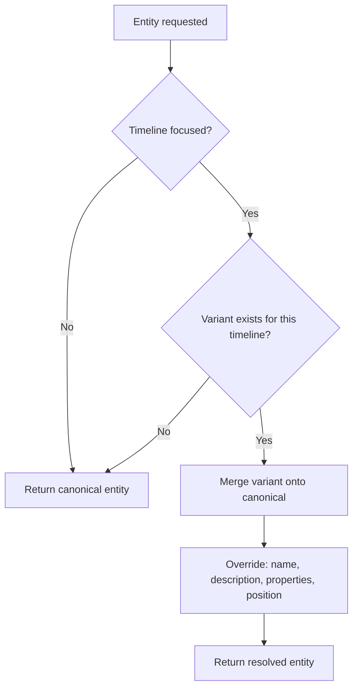
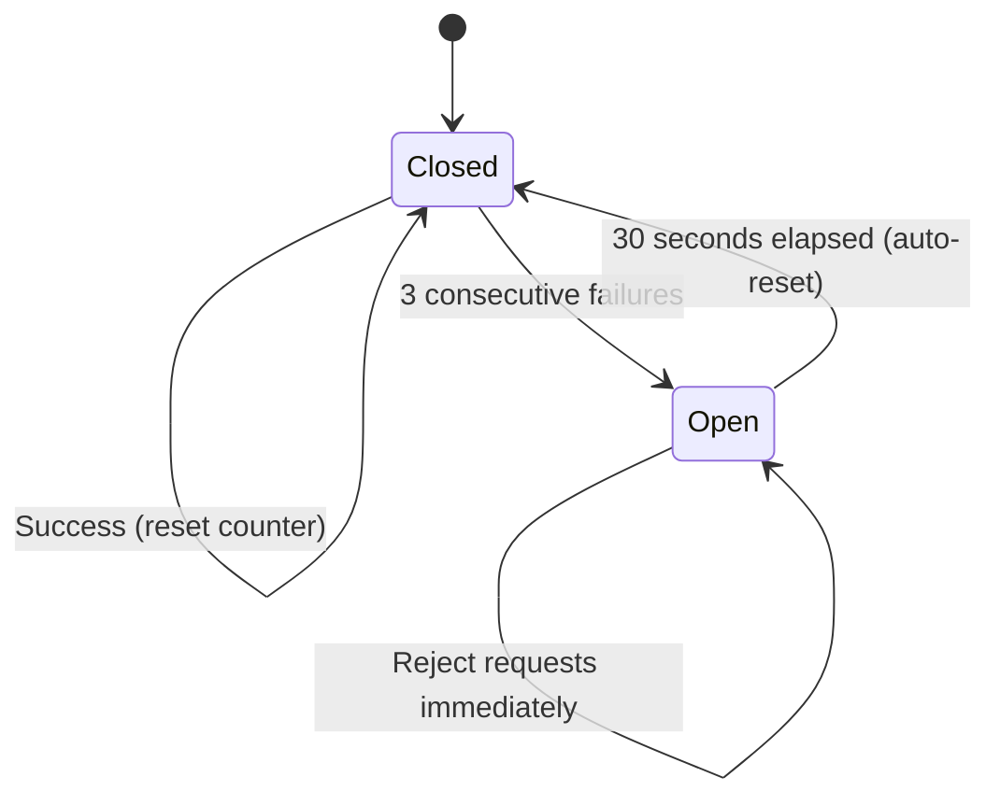
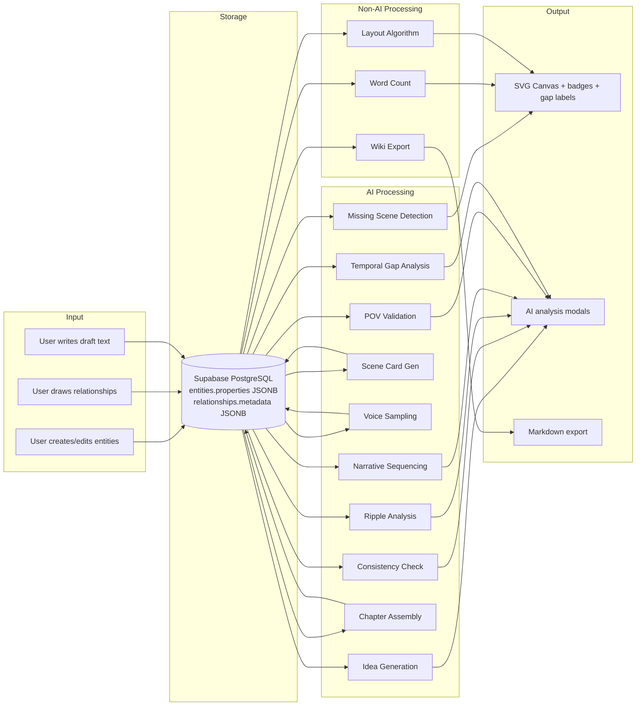

# Chronos — Core Algorithms

## Overview

Chronos is a multi-timeline narrative tool. Its output is driven by three layers: **data modeling**, **AI-powered analysis**, and **visual layout**.

---

## 1. Data Model & Entity Resolution

### Entity Types
```
character | timeline | event | arc | theme | location | note | chapter
```

### Entity Property Schema

Beyond core fields (`name`, `description`, `color`), entities store feature data in a JSONB `properties` column:

| Property | Entity Type | Purpose |
|----------|-------------|---------|
| `scene_card` | event | AI-generated scene outline (POV, goal, conflict, resolution) |
| `voice_samples` | character | AI-generated dialogue lines showing personality |
| `emotion_level` | event | Emotional intensity (-5 to +5) for beat tracking |
| `pov_character` | event | Assigned POV character reference `{id, name}` |
| `timestamp` | event | In-story temporal position for gap calculation |
| `draft_text` | event | Manuscript text linked to this scene |
| `chapter_blueprint` | chapter | AI-assembled structural blueprint |

### Relationship Metadata Schema

Relationships store additional data in a JSONB `metadata` column:

| Property | Purpose |
|----------|---------|
| `strength` | Visual importance (1–5) for line thickness on canvas |

### Timeline Variant Resolution Algorithm
When a user focuses on a specific timeline, entities are resolved with overrides:



**Merge priority:** `variant_properties > entity.properties`, with null variant fields falling back to canonical.

---

## 2. AI Algorithms

Chronos has **10 AI algorithms**, each with different tuning parameters:

### 2.1 Idea Generation (Creative)
| Parameter | Value |
|-----------|-------|
| Temperature | **0.8** (high creativity) |
| Max tokens | 2,000 |
| Output | 5 ideas with confidence scores |

**Algorithm flow:**
1. Build contextual prompt with entity name, type, description, linked entities, and project context
2. Request 5 creative ideas with title, description, and confidence (0.0–1.0)
3. Parse JSON response (handles markdown code block wrapping)
4. Assign unique IDs and cache results

### 2.2 Consistency Checking (Analytical)
| Parameter | Value |
|-----------|-------|
| Temperature | **0.3** (low, analytical precision) |
| Max tokens | 4,000 |
| Output | 0–10 issues ranked by severity |

**Issue categories:**
- 🔴 `timeline_paradox` — Events that can't coexist in the same timeline
- ⚠️ `character_conflict` — Contradictory character traits/states
- 🔗 `causality_break` — Effects without causes
- 💡 `logic_gap` — Missing connections or unexplained jumps

**Algorithm flow:**
1. Group all entities by type for structured context
2. Include entity properties when available
3. Scope to project-wide or single timeline
4. Parse issues with severity validation (`error > warning > suggestion`)

### 2.3 Ripple Effect Analysis (Predictive)
| Parameter | Value |
|-----------|-------|
| Temperature | **0.3** (analytical) |
| Max tokens | 4,000 |
| Output | 0–8 effects ranked by impact |

**Algorithm flow:**
1. Compare entity description **before** vs **after** edit
2. Include all related entities within **2 relationship hops**
3. Classify impacts: 🔴 high (direct contradiction), 🟡 medium (needs attention), 🟢 low (optional)
4. Each effect includes a suggested adjustment for maintaining consistency

### 2.4 Scene Card Generation (Creative)
| Parameter | Value |
|-----------|-------|
| Temperature | **0.7** |
| Max tokens | 1,500 |
| Output | Structured scene outline |

**Algorithm flow:**
1. Collect event entity + connected characters, locations, themes via relationships
2. AI generates: POV character, scene goal, conflict, resolution, sensory details
3. Output saved to `properties.scene_card` as structured JSON
4. Displayed as expandable card in entity detail panel

### 2.5 Character Voice Sampling (Creative)
| Parameter | Value |
|-----------|-------|
| Temperature | **0.9** (high variety) |
| Max tokens | 1,000 |
| Output | 3 dialogue lines per character |

**Algorithm flow:**
1. Analyze character description + connected themes/arcs
2. Generate 3 sample dialogue lines showing personality
3. Each sample includes context tag + dialogue + internal thought
4. Saved to `properties.voice_samples`

### 2.6 Narrative Sequence Building (Structural)
| Parameter | Value |
|-----------|-------|
| Temperature | **0.4** |
| Max tokens | 3,000 |
| Output | Ordered sequence of narrative steps |

**Algorithm flow:**
1. Scan all event entities with `happens_before`/`happens_after` relationships
2. Topological sort using relationship edges
3. AI enriches each step with transition suggestions between scenes
4. Output: ordered chapters with beat descriptions

### 2.7 Missing Scene Detection (Analytical)
| Parameter | Value |
|-----------|-------|
| Temperature | **0.5** |
| Max tokens | 3,000 |
| Output | 0–5 suggested missing scenes |

**Algorithm flow:**
1. Analyze event sequence for narrative gaps
2. Check character locations across consecutive events (character in Location A → suddenly in Location B)
3. Identify missing transitions, setup scenes, or payoff scenes
4. Suggested scenes rendered as ghost nodes (dotted outline) on canvas — user can confirm or dismiss

### 2.8 POV Consistency Validation (Analytical)
| Parameter | Value |
|-----------|-------|
| Temperature | **0.3** |
| Max tokens | 2,000 |
| Output | POV issues + character distribution map |

**Issue types:**
- 🔴 `missing_pov` — Event has no assigned POV character
- ⚠️ `imbalance` — Uneven POV distribution across events
- ⚠️ `head_hopping` — Consecutive events switch POV without scene break
- 💡 `suggestion` — Recommendations for POV improvements

**Algorithm flow:**
1. Extract all events with their `pov_character` assignments
2. Build character frequency distribution
3. AI analyzes patterns for head-hopping and imbalance
4. Returns issues array + `povDistribution: Record<string, number>`

### 2.9 Chapter Assembly (Creative/Structural)
| Parameter | Value |
|-----------|-------|
| Temperature | **0.6** |
| Max tokens | 4,000 |
| Output | Complete chapter blueprint |

**Blueprint structure:**
```typescript
{
    synopsis: string;
    openingHook?: string;
    structure: Array<{ beat: string; scene: string; emotionalNote: string }>;
    closingHook?: string;
    tensions?: string[];
    characterArcs?: Array<{ character: string; arc: string }>;
}
```

**Algorithm flow:**
1. Collect all events linked to the chapter entity via relationships
2. Include scene cards, emotional arcs, voice samples, draft text from connected events
3. Pull connected character entities for arc tracking
4. AI synthesizes into a comprehensive chapter blueprint
5. Blueprint saved to `properties.chapter_blueprint`

### 2.10 Temporal Gap Analysis (Analytical)
| Parameter | Value |
|-----------|-------|
| Temperature | **0.3** |
| Max tokens | 2,000 |
| Output | Gap labels + warnings |

**Algorithm flow:**
1. Collect all events with `properties.timestamp` values
2. Sort chronologically
3. Compute time deltas between consecutive events
4. AI flags suspicious gaps (e.g., "10-year gap with no explained character aging")
5. Each gap returns: `fromEvent`, `toEvent`, `gapLabel`, optional `warning`

---

## 3. Non-AI Algorithms

### 3.1 Worldbuilding Wiki Export
**Algorithm:** Template rendering (no AI required)
1. Query all entities grouped by type
2. For each entity: render name, description, connected entities via relationships
3. Output as structured markdown
4. Supports clipboard copy or `.md` file download

### 3.2 Draft Word Count
**Algorithm:** `text.split(/\s+/).filter(Boolean).length`
- Applied to `properties.draft_text` on event/chapter nodes
- Chapter word estimate: `connectedEvents.length × 2000`
- Progress display: `drafted / estimated`

### 3.3 Emotional Beat Color Mapping
**Algorithm:**
```
eLevel > 0 → warm gradient (green → yellow)
eLevel < 0 → cool gradient (blue → red)
eLevel = 0 → neutral (gray)
```
- Rendered as 4px color bar at bottom of event nodes
- Emoji badge: `😄 >= 3`, `🙂 >= 1`, `😟 <= -1`, `😢 <= -3`

### 3.4 Temporal Gap Label Computation
**Algorithm:** Client-side date diff between consecutive timestamped events
```
diffDays >= 365 → "X years later"
diffDays >= 30  → "X months later"
diffDays >= 1   → "X days later"
```
- Rendered as floating ⏳ label pills on canvas between event node pairs

---

## 4. AI Infrastructure

### Circuit Breaker Pattern


- **Threshold:** 3 failures
- **Reset:** 30 seconds
- Per-provider tracking (OpenAI, Anthropic, Google separate)

### Multi-Provider Failover
```
User's preferred provider → OpenAI → Anthropic → Google
```
If the preferred provider fails or its circuit breaker is open, the next provider with a configured API key is tried automatically.

### Response Cache
- **TTL:** 5 minutes
- **Key strategy:** `{operation}:{entity_name}:{entity_type}:{description_prefix}`
- Prevents duplicate API calls for the same entity analysis

---

## 5. Canvas Layout Algorithm

### Type-Based Layout (Default)

Entities are organized into horizontal **swim lanes** by type:

```
Lane order: timeline → event → chapter → character → arc → theme → location → note
```

**Algorithm:**
1. Filter visible entities (exclude hidden types)
2. Build lane definitions with counts and colors
3. Position each entity:
   - **Y:** `50 + laneIndex × (200 + 16)` — center of its type lane
   - **X:** `180 + 40 + entityIndex × 350` — spaced horizontally within lane
4. Snap positions to 20px grid

### Timeline-Based Layout

When "Timeline View" is active, lanes represent timelines instead of types:
1. First lane: **Canonical** (entities without timeline-specific variants)
2. Additional lanes: One per timeline entity
3. Entities with variants appear in multiple lanes (marked with `⇅ shared`)
4. Divergent variants are marked with a purple ◇ `DIFF` badge

### Relationship Rendering
- Curved Bézier paths between connected entities
- Per-relationship gradient (source color → target color)
- Floating label on each curve midpoint
- Arrow marker at destination
- **Line thickness:** 1.1px–3.5px based on `metadata.strength` (1–5)
- **Opacity:** 0.44–1.0 scaled with strength

### Node Visual Badges

Each entity node can display multiple simultaneous badges:

| Badge | Position | Condition |
|-------|----------|-----------|
| 👁️ POV character | Top-right | Event with `pov_character` assigned |
| 📝 Word count | Top-left | Event/chapter with `draft_text` |
| 🔗 Connections | Bottom-right | Any entity with relationships |
| 😊 Emotion bar | Bottom edge | Event with `emotion_level ≠ 0` |
| 🔀 Variant count | Top-right corner | Entity with timeline variants |
| ◇ DIFF | Top-right corner | Divergent variant in timeline view |
| ✔/⚠/✗ Status | Top-right | After consistency check |

### Temporal Gap Labels
Between consecutive timestamped event nodes:
- Dotted connector line above nodes
- Floating ⏳ pill label with computed gap ("3 years later")

---

## 6. Data Flow Summary


