# Chronos: High-Level System Architecture
**Solution Architecture Document**

**Version:** 1.0  
**Date:** February 10, 2026  
**Architect:** Solution Architecture Team  
**Status:** Draft for Review

---

## Table of Contents

1. [Executive Summary](#executive-summary)
2. [Architectural Overview](#architectural-overview)
3. [Design Principles](#design-principles)
4. [System Component Architecture](#system-component-architecture)
5. [Data Architecture](#data-architecture)
6. [AI Integration Architecture](#ai-integration-architecture)
7. [API Architecture](#api-architecture)
8. [Frontend Architecture](#frontend-architecture)
9. [Security Architecture](#security-architecture)
10. [Deployment Architecture](#deployment-architecture)
11. [Technology Stack Decisions](#technology-stack-decisions)
12. [Scalability & Performance](#scalability--performance)
13. [Appendices](#appendices)

---

## Executive Summary

Chronos is a **cloud-first, AI-powered narrative management system** designed for extreme multi-timeline complexity. The architecture is built on three foundational pillars:

1. **Knowledge Graph Engine** - PostgreSQL (Neon/Supabase) with graph-like relationship modeling
2. **Multi-AI Intelligence Layer** - Provider-agnostic AI abstraction supporting OpenAI, Anthropic, Google, and local models
3. **Real-time Collaborative Frontend** - React-based desktop (Electron) and web (PWA) applications with offline-first capabilities

### Key Architectural Characteristics

| Characteristic | Approach | Rationale |
|----------------|----------|-----------|
| **Data Strategy** | Cloud-first with offline caching | Enables collaboration, scales seamlessly |
| **AI Strategy** | Multi-provider with automatic failover | Ensures availability, optimizes cost |
| **State Management** | Optimistic UI with eventual consistency | Superior UX, handles network variability |
| **Performance** | Edge computing + aggressive caching | <100ms CRUD, <2s canvas rendering |
| **Deployment** | Serverless + CDN distribution | Minimal ops overhead, infinite scale |

---

## Architectural Overview

### High-Level System Diagram

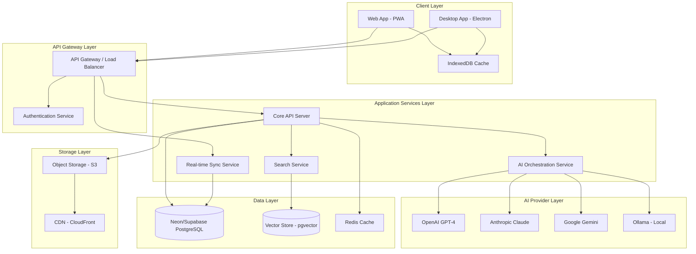

### Request Flow Example: Update Event Entity

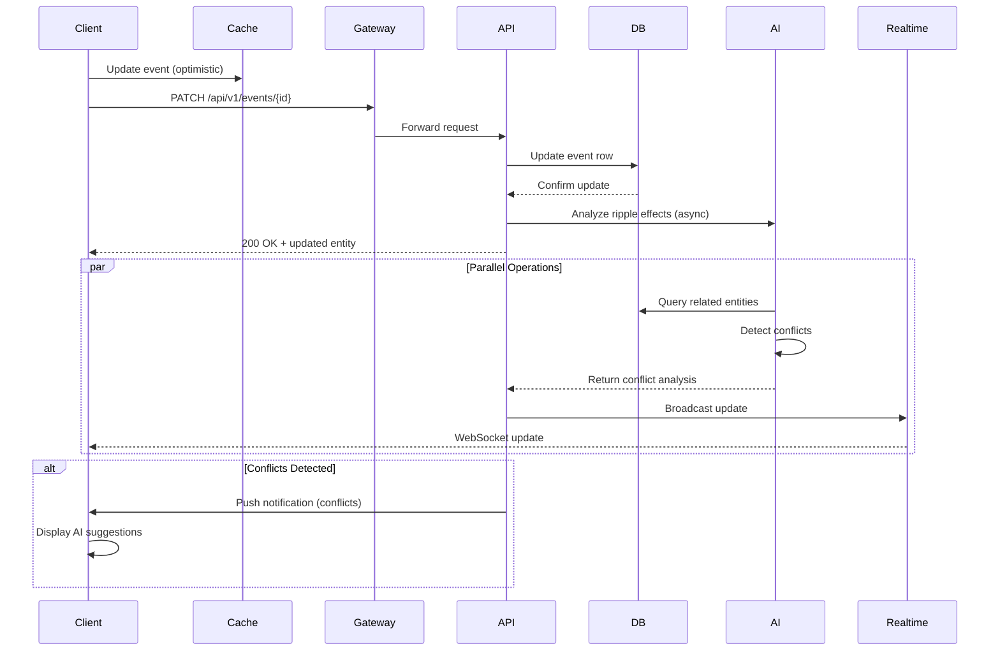

---

## Design Principles

### 1. **Optimistic UI, Eventual Consistency**

**Principle:** All user actions are immediately reflected in the UI, then synced to the server asynchronously.

**Implementation:**
- Client-side state management (Zustand) updates immediately
- Operations queued in IndexedDB for sync
- Server response reconciles client state
- Conflicts resolved via last-write-wins + manual merge UI

**Trade-off:** Slight risk of conflict vs. superior perceived performance

---

### 2. **Graph-First Data Modeling**

**Principle:** Everything is a node; connections are first-class citizens.

**Implementation:**
- Relational tables with adjacency lists
- Recursive CTEs for graph traversal
- JSONB for dynamic properties
- Full-text search via PostgreSQL FTS

**Why Not Neo4j?**
- PostgreSQL offers sufficient graph capabilities for MVP
- Neon/Supabase ecosystem integration (auth, real-time, edge functions)
- Easier team onboarding (SQL vs. Cypher)
- Can migrate to dedicated graph DB post-MVP if needed

---

### 3. **AI as a Service Layer, Not a Feature**

**Principle:** AI is architectural infrastructure, not a tacked-on capability.

**Implementation:**
- Dedicated AI orchestration service
- Provider-agnostic abstraction layer
- Intelligent routing (cost, latency, capability)
- Circuit breakers for failover

**Impact:** Can swap providers, upgrade models, or add new capabilities without touching core business logic.

---

### 4. **Offline-First, Cloud-Native**

**Principle:** App must work offline; cloud enhances but doesn't enable.

**Implementation:**
- All core CRUD operations work with local cache
- Sync queue persists operations until reconnection
- Read-through cache for frequently accessed data
- ConflictDB (CRDT-inspired) for critical entity types

---

### 5. **Security by Default**

**Principle:** Every layer enforces security; no implicit trust.

**Implementation:**
- Row-Level Security (RLS) in Supabase
- JWT-based authentication
- API key rotation for AI providers
- Encryption at rest (database) and in transit (TLS 1.3)

---

## System Component Architecture

### Component Breakdown

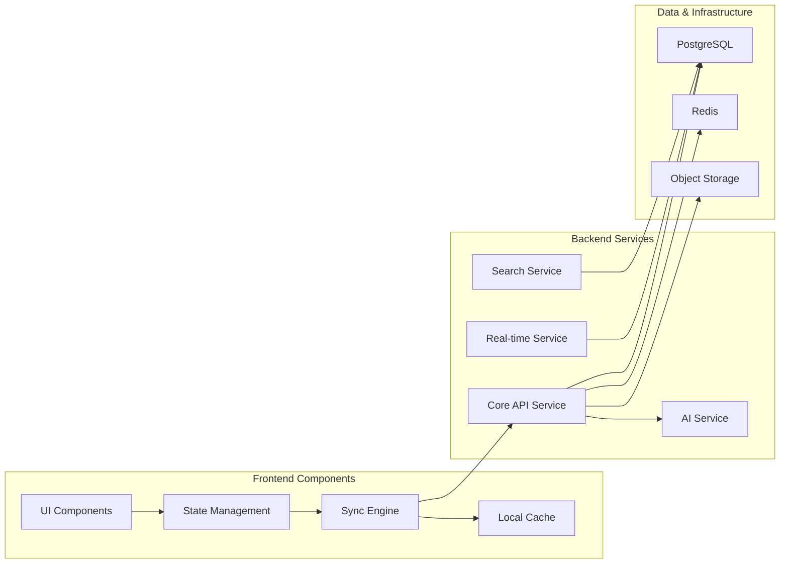

### Core API Service

**Responsibilities:**
- Entity CRUD operations (Characters, Events, Timelines, Arcs, Themes, Locations, Notes)
- Relationship management (create, update, delete relationships)
- Business logic validation
- Orchestrate AI service calls
- Manage user sessions and permissions

**Technology:** Node.js (TypeScript) with Express.js or Fastify

**Key Endpoints:**
```
POST   /api/v1/entities/{type}           # Create entity
GET    /api/v1/entities/{type}/{id}      # Read entity
PATCH  /api/v1/entities/{type}/{id}      # Update entity
DELETE /api/v1/entities/{type}/{id}      # Delete entity
GET    /api/v1/entities/{type}           # List entities (with filters)

POST   /api/v1/relationships              # Create relationship
GET    /api/v1/relationships/{id}         # Get relationship
DELETE /api/v1/relationships/{id}         # Delete relationship
GET    /api/v1/graph/traverse             # Graph traversal query
```

**Performance Target:** P95 latency <100ms

---

### AI Orchestration Service

**Responsibilities:**
- Route AI requests to appropriate provider
- Manage API keys and rate limits
- Implement circuit breakers and retries
- Cost tracking and optimization
- Prompt template management
- Response caching for repeated queries

**Architecture:**

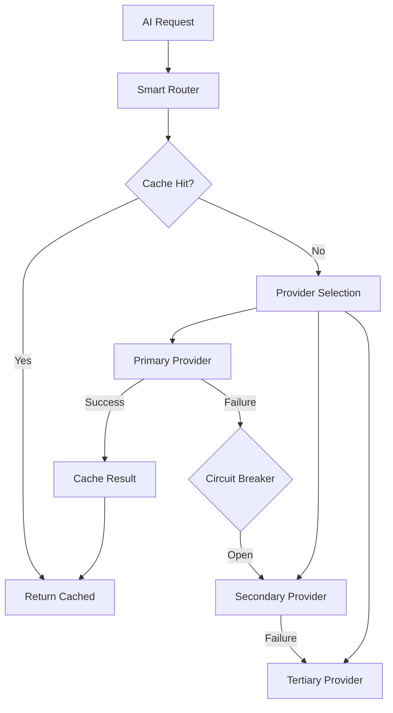

**Provider Selection Logic:**

```typescript
interface AIRequest {
  task: 'idea_generation' | 'consistency_check' | 'gap_analysis' | 'suggestion';
  context: EntityContext;
  priority: 'low' | 'medium' | 'high';
}

// Provider routing rules
const providerRules = {
  idea_generation: {
    primary: 'claude-3.5-sonnet',     // Best creative output
    secondary: 'gpt-4-turbo',
    cost_optimized: 'gemini-pro'
  },
  consistency_check: {
    primary: 'gpt-4',                  // Best logical reasoning
    secondary: 'claude-3-opus',
    cost_optimized: 'gpt-3.5-turbo'
  },
  gap_analysis: {
    primary: 'claude-3-opus',          // Best analytical depth
    secondary: 'gpt-4',
    cost_optimized: 'gemini-pro'
  }
};
```

**Failover Strategy:**
- Primary fails → Secondary (within 2s)
- Secondary fails → Tertiary
- All fail → Graceful degradation (rule-based fallback)

---

### Real-time Sync Service

**Responsibilities:**
- Broadcast entity changes to all connected clients
- Manage WebSocket connections
- Handle presence (who's editing what)
- Conflict detection and notification

**Technology:** Supabase Realtime (WebSocket subscriptions to PostgreSQL)

**Flow:**

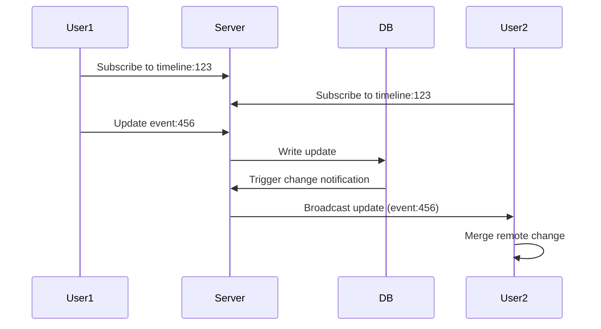

**Conflict Resolution:**
```typescript
interface ConflictResolution {
  strategy: 'last_write_wins' | 'manual_merge' | 'operational_transform';
  
  // For critical entities (plot events), prompt manual merge
  criticalEntities: ['Event', 'Arc'];
  
  // For metadata (notes), use last-write-wins
  nonCriticalEntities: ['Note', 'Idea'];
}
```

---

### Search Service

**Responsibilities:**
- Full-text search across all entity types
- Relationship-aware search (find entities connected to X)
- Fuzzy matching for character names, locations
- Search result ranking by relevance

**Technology:** PostgreSQL Full-Text Search (FTS) + pgvector for semantic search

**Implementation:**

```sql
-- GIN index for full-text search
CREATE INDEX idx_entities_fts ON entities 
USING GIN (to_tsvector('english', name || ' ' || description));

-- Vector index for semantic similarity
CREATE INDEX idx_entities_vector ON entities 
USING ivfflat (embedding vector_cosine_ops);

-- Combined search query
WITH text_results AS (
  SELECT id, ts_rank(to_tsvector('english', name || ' ' || description), query) AS rank
  FROM entities, plainto_tsquery('english', $1) query
  WHERE to_tsvector('english', name || ' ' || description) @@ query
),
vector_results AS (
  SELECT id, 1 - (embedding <=> $2::vector) AS similarity
  FROM entities
  ORDER BY embedding <=> $2::vector
  LIMIT 20
)
SELECT e.* FROM entities e
JOIN text_results tr ON e.id = tr.id
ORDER BY tr.rank DESC;
```

---

## Data Architecture

### Database Schema Design

#### Core Tables

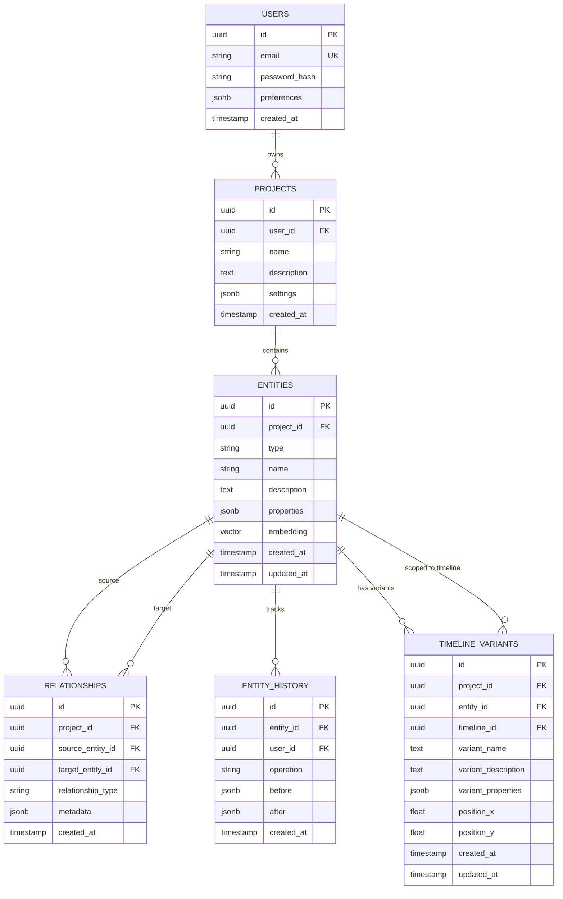

#### Entity Type Specialization

Rather than separate tables for each entity type, we use **JSONB polymorphism**:

```sql
CREATE TYPE entity_type AS ENUM (
  'character', 'timeline', 'event', 'arc', 'theme', 'location', 'note'
);

CREATE TABLE entities (
  id UUID PRIMARY KEY DEFAULT gen_random_uuid(),
  project_id UUID NOT NULL REFERENCES projects(id) ON DELETE CASCADE,
  type entity_type NOT NULL,
  name VARCHAR(255) NOT NULL,
  description TEXT,
  
  -- Polymorphic properties stored as JSONB
  properties JSONB NOT NULL DEFAULT '{}',
  
  -- Full-text search
  search_vector tsvector GENERATED ALWAYS AS (
    to_tsvector('english', name || ' ' || COALESCE(description, ''))
  ) STORED,
  
  -- Semantic search (AI-generated embeddings)
  embedding vector(1536),  -- OpenAI ada-002 dimension
  
  created_at TIMESTAMPTZ NOT NULL DEFAULT NOW(),
  updated_at TIMESTAMPTZ NOT NULL DEFAULT NOW()
);

-- Example: Character entity
{
  "type": "character",
  "name": "Alice",
  "description": "Protagonist from Timeline A",
  "properties": {
    "biography": "...",
    "motivations": ["revenge", "redemption"],
    "timeline_presence": ["timeline-uuid-1", "timeline-uuid-3"],
    "internal_conflicts": ["loyalty vs. duty"],
    "relationships": [
      {
        "character_id": "uuid-bob",
        "type": "mentor",
        "description": "Alice's former teacher"
      }
    ]
  }
}
```

**Why JSONB over Separate Tables?**
- Flexibility: Easy to add entity-specific fields without migrations
- Performance: Single table queries are faster than joins
- Simplicity: One CRUD API for all entity types
- PostgreSQL JSONB indexing is highly performant

---

### Relationship Graph Model

```sql
CREATE TABLE relationships (
  id UUID PRIMARY KEY DEFAULT gen_random_uuid(),
  project_id UUID NOT NULL REFERENCES projects(id) ON DELETE CASCADE,
  
  source_entity_id UUID NOT NULL REFERENCES entities(id) ON DELETE CASCADE,
  target_entity_id UUID NOT NULL REFERENCES entities(id) ON DELETE CASCADE,
  
  -- User-defined relationship type
  relationship_type VARCHAR(100) NOT NULL,
  
  -- Optional metadata (e.g., when relationship started, strength)
  metadata JSONB DEFAULT '{}',
  
  created_at TIMESTAMPTZ NOT NULL DEFAULT NOW(),
  
  -- Prevent duplicate relationships
  CONSTRAINT unique_relationship UNIQUE (source_entity_id, target_entity_id, relationship_type)
);

-- Indexes for graph traversal
CREATE INDEX idx_relationships_source ON relationships(source_entity_id);
CREATE INDEX idx_relationships_target ON relationships(target_entity_id);
CREATE INDEX idx_relationships_type ON relationships(relationship_type);
```

**Graph Traversal Query Example:**

Find all entities connected to a character within 2 hops:

```sql
WITH RECURSIVE entity_graph AS (
  -- Base case: direct relationships
  SELECT 
    r.target_entity_id AS entity_id,
    r.relationship_type,
    1 AS depth
  FROM relationships r
  WHERE r.source_entity_id = $1  -- Starting entity
  
  UNION
  
  -- Recursive case: follow relationships
  SELECT 
    r.target_entity_id,
    r.relationship_type,
    eg.depth + 1
  FROM entity_graph eg
  JOIN relationships r ON eg.entity_id = r.source_entity_id
  WHERE eg.depth < 2  -- Limit to 2 hops
)
SELECT DISTINCT e.*
FROM entity_graph eg
JOIN entities e ON eg.entity_id = e.id;
```

**Performance:** <200ms for 3-hop queries on 10K entity graph (indexed)

---

### Database Choice: Neon vs. Supabase

| Feature | Neon | Supabase | Recommendation |
|---------|------|----------|----------------|
| **PostgreSQL** | ✅ Vanilla PostgreSQL 16 | ✅ PostgreSQL 15+ | Both excellent |
| **Serverless** | ✅ True serverless (scale-to-zero) | ❌ Always-on instances | Neon for cost |
| **Branching** | ✅ Database branching (like Git) | ❌ No branching | Neon for dev workflow |
| **Real-time** | ❌ No built-in real-time | ✅ Real-time subscriptions | Supabase for collaboration |
| **Auth** | ❌ BYO auth | ✅ Built-in auth (JWT) | Supabase for faster MVP |
| **Edge Functions** | ❌ No edge compute | ✅ Deno edge functions | Supabase for serverless logic |
| **Cost** | $ Lower (pay-per-use) | $$ Higher (instance-based) | Neon for scale |
| **Latency** | ⚡ Edge regions available | ⚡ Global regions | Tie |

**Architectural Decision: Use Supabase for MVP**

**Rationale:**
- Real-time subscriptions critical for collaborative features
- Built-in auth accelerates development
- Row-level security (RLS) simplifies multi-tenancy
- Can migrate to Neon post-MVP if cost becomes concern

**Migration Path:** Supabase uses standard PostgreSQL, so migration to Neon is straightforward (dump/restore + rebuild real-time layer).

---

### Database Performance Optimization

#### 1. Indexing Strategy

```sql
-- Full-text search
CREATE INDEX idx_entities_search ON entities USING GIN (search_vector);

-- Vector similarity search (for semantic search)
CREATE INDEX idx_entities_embedding ON entities 
USING ivfflat (embedding vector_cosine_ops) WITH (lists = 100);

-- Entity lookups by project
CREATE INDEX idx_entities_project_type ON entities(project_id, type);

-- Relationship graph traversal
CREATE INDEX idx_relationships_source ON relationships(source_entity_id);
CREATE INDEX idx_relationships_target ON relationships(target_entity_id);

-- Timeline filtering
CREATE INDEX idx_entities_properties_timeline ON entities 
USING GIN ((properties -> 'timeline_ids'));
```

#### 2. Caching Strategy

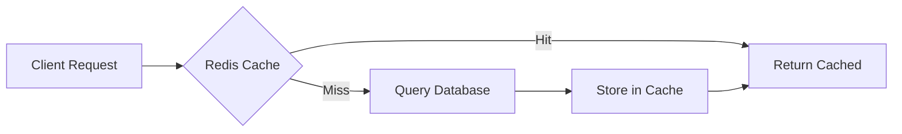

**Cache Policies:**
- **Entities:** Cache for 5 minutes, invalidate on update
- **Relationships:** Cache for 10 minutes (less volatile)
- **Graph traversal results:** Cache for 1 minute (computationally expensive)
- **Search results:** Cache for 30 seconds (frequently changing)

**Cache Keys:**
```typescript
const cacheKeys = {
  entity: (id: string) => `entity:${id}`,
  entityList: (projectId: string, type: string, page: number) => 
    `entities:${projectId}:${type}:${page}`,
  relationships: (entityId: string) => `relationships:${entityId}`,
  graphTraversal: (entityId: string, depth: number) => 
    `graph:${entityId}:${depth}`,
};
```

#### 3. Connection Pooling

```typescript
// Supabase client configuration
const supabase = createClient(SUPABASE_URL, SUPABASE_KEY, {
  db: {
    poolSize: 20,  // Max concurrent connections
  },
  global: {
    headers: { 'x-application-name': 'chronos-api' },
  },
});
```

---

## AI Integration Architecture

### Multi-Provider Abstraction Layer

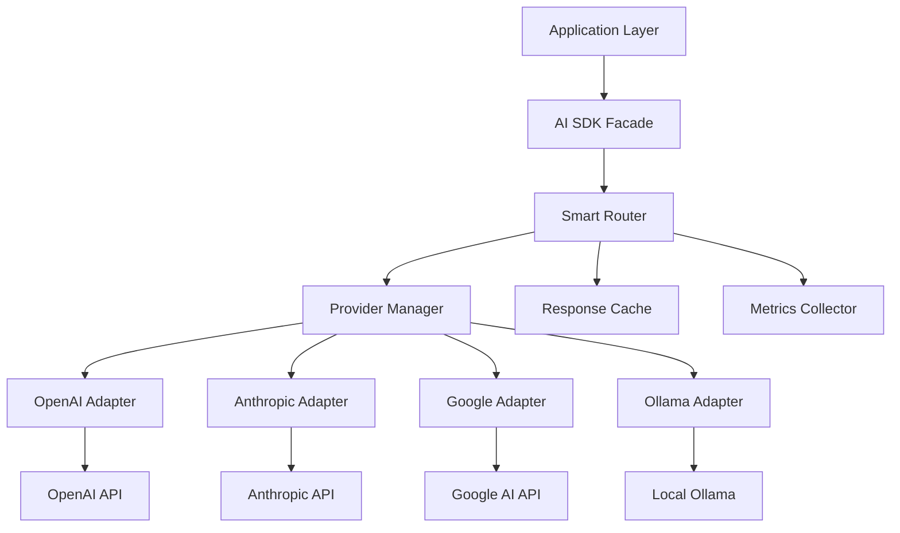

### AI SDK Interface

```typescript
// Core abstraction interface
interface AIProvider {
  name: string;
  models: string[];
  
  generateIdea(context: NarrativeContext, prompt: string): Promise<AIResponse>;
  analyzeConsistency(entities: Entity[]): Promise<ConsistencyReport>;
  suggestRelationships(entity: Entity): Promise<RelationshipSuggestion[]>;
  detectConflicts(change: EntityChange): Promise<ConflictAnalysis>;
}

// Unified request/response types
interface AIRequest {
  task: AITask;
  context: NarrativeContext;
  options?: {
    temperature?: number;
    maxTokens?: number;
    model?: string;
  };
}

interface AIResponse {
  content: string;
  model: string;
  provider: string;
  tokens: number;
  latency: number;
  cached: boolean;
}

// Smart router implementation
class AIRouter {
  async execute(request: AIRequest): Promise<AIResponse> {
    // 1. Check cache
    const cached = await this.cache.get(request);
    if (cached) return cached;
    
    // 2. Select provider based on task type, user preference, and availability
    const provider = await this.selectProvider(request);
    
    // 3. Execute with circuit breaker
    try {
      const response = await this.executeWithRetry(provider, request);
      await this.cache.set(request, response, TTL_5MIN);
      return response;
    } catch (error) {
      // 4. Fallback to secondary provider
      return this.executeWithFallback(request, provider);
    }
  }
  
  private async selectProvider(request: AIRequest): Promise<AIProvider> {
    const userPreference = await this.getUserPreference(request.context.userId);
    const taskConfig = this.taskProviderMap[request.task];
    
    // Use user-configured model if available and capable
    if (userPreference && this.isCapable(userPreference, request.task)) {
      return this.providers[userPreference];
    }
    
    // Otherwise use task-optimized default
    return this.providers[taskConfig.primary];
  }
}
```

### Prompt Template System

```typescript
// Centralized prompt templates with versioning
const promptTemplates = {
  idea_generation: {
    version: '1.2',
    template: `You are a creative writing assistant specializing in {{genre}} narratives.

Context:
- Character: {{character.name}}
- Current situation: {{context.event}}
- Timeline: {{context.timeline}}
- Themes: {{themes}}

Generate 3 creative plot developments that:
1. Advance the character's arc
2. Create narrative tension
3. Remain consistent with established timeline rules

Format as JSON array of ideas with 'description' and 'impact' fields.`,
  },
  
  consistency_check: {
    version: '1.1',
    template: `Analyze the following narrative modification for logical consistency.

Original state:
{{original}}

Proposed change:
{{change}}

Related entities:
{{relatedEntities}}

Identify:
1. Timeline paradoxes
2. Character inconsistencies
3. Broken causal chains

Return JSON with 'conflicts' array and 'severity' (low/medium/high) for each.`,
  },
};

// Template rendering
function renderPrompt(templateId: string, context: Record<string, any>): string {
  const template = promptTemplates[templateId];
  return Mustache.render(template.template, context);
}
```

### AI Cost Optimization

```typescript
// Track costs per provider
interface CostTracker {
  provider: string;
  model: string;
  inputTokens: number;
  outputTokens: number;
  totalCost: number;  // USD
}

// Cost-based routing
class CostOptimizer {
  async selectModel(task: AITask, budget: 'low' | 'medium' | 'high'): Promise<string> {
    const modelCosts = {
      'gpt-4': { input: 0.03, output: 0.06 },       // per 1K tokens
      'gpt-3.5-turbo': { input: 0.001, output: 0.002 },
      'claude-3.5-sonnet': { input: 0.003, output: 0.015 },
      'claude-3-haiku': { input: 0.00025, output: 0.00125 },
      'gemini-pro': { input: 0.00025, output: 0.0005 },
    };
    
    if (budget === 'low') {
      return task === 'consistency_check' ? 'gpt-3.5-turbo' : 'gemini-pro';
    } else if (budget === 'high') {
      return 'gpt-4';
    }
    
    // Medium: task-optimized
    return this.taskModelMap[task];
  }
}
```

---

## API Architecture

### RESTful API Design

**Base URL:** `https://api.chronos.app/v1`

#### Authentication
```
Authorization: Bearer <JWT_TOKEN>
```

#### Core Endpoints

##### Entities

```
POST   /projects/{projectId}/entities
GET    /projects/{projectId}/entities
GET    /projects/{projectId}/entities/{entityId}
PATCH  /projects/{projectId}/entities/{entityId}
DELETE /projects/{projectId}/entities/{entityId}

# Bulk operations
POST   /projects/{projectId}/entities/bulk
PATCH  /projects/{projectId}/entities/bulk
```

**Example Request:**
```json
POST /projects/abc-123/entities
{
  "type": "character",
  "name": "Alice",
  "description": "Protagonist from Timeline A",
  "properties": {
    "biography": "Born in Neo-Tokyo, 2157",
    "motivations": ["revenge", "redemption"]
  }
}
```

**Example Response:**
```json
{
  "id": "char-456",
  "type": "character",
  "name": "Alice",
  "description": "Protagonist from Timeline A",
  "properties": { ... },
  "created_at": "2026-02-10T19:00:00Z",
  "updated_at": "2026-02-10T19:00:00Z"
}
```

##### Relationships

```
POST   /projects/{projectId}/relationships
GET    /projects/{projectId}/relationships
GET    /projects/{projectId}/relationships/{relationshipId}
DELETE /projects/{projectId}/relationships/{relationshipId}

# Get all relationships for an entity
GET    /projects/{projectId}/entities/{entityId}/relationships
```

##### Graph Queries

```
# Traverse graph from entity
GET    /projects/{projectId}/graph/traverse?entityId={id}&depth={n}

# Find shortest path between two entities
GET    /projects/{projectId}/graph/path?source={id1}&target={id2}

# Get entity neighborhood
GET    /projects/{projectId}/graph/neighbors?entityId={id}&relationshipType={type}
```

##### AI Operations

```
# Generate ideas
POST   /projects/{projectId}/ai/generate-ideas
{
  "entityId": "char-456",
  "task": "plot_development",
  "context": { ... }
}

# Analyze consistency
POST   /projects/{projectId}/ai/analyze-consistency
{
  "entityIds": ["event-123", "event-456"],
  "scope": "timeline"
}

# Detect conflicts (ripple analysis)
POST   /projects/{projectId}/ai/detect-conflicts
{
  "changeType": "update",
  "entityId": "event-789",
  "before": { ... },
  "after": { ... }
}
```

##### Search

```
GET /projects/{projectId}/search?q={query}&type={entityType}&limit={n}
GET /projects/{projectId}/search/semantic?q={query}&threshold={similarity}
```

### API Rate Limiting

```typescript
const rateLimits = {
  free: {
    requests: 100,    // per hour
    aiCalls: 10,      // AI operations per hour
  },
  pro: {
    requests: 1000,
    aiCalls: 100,
  },
  enterprise: {
    requests: 10000,
    aiCalls: 1000,
  },
};

// Rate limit headers
HTTP/1.1 200 OK
X-RateLimit-Limit: 100
X-RateLimit-Remaining: 73
X-RateLimit-Reset: 1644523200
```

---

## Frontend Architecture

### Component Hierarchy

```
chronos-app/
├── src/
│   ├── core/                   # Core business logic
│   │   ├── entities/           # Entity models & services
│   │   ├── graph/              # Graph traversal logic
│   │   └── sync/               # Offline sync engine
│   ├── features/               # Feature modules
│   │   ├── timeline-canvas/    # Timeline visualization
│   │   ├── entity-editor/      # Entity CRUD UI
│   │   ├── ai-assistant/       # AI interaction UI
│   │   └── search/             # Search interface
│   ├── ui/                     # Shared UI components
│   │   ├── primitives/         # Buttons, inputs, etc.
│   │   ├── layouts/            # Page layouts
│   │   └── dialogs/            # Modals & overlays
│   ├── state/                  # Global state management
│   │   ├── stores/             # Zustand stores
│   │   └── queries/            # TanStack Query hooks
│   └── services/               # External integrations
│       ├── api/                # API client
│       ├── ai/                 # AI service client
│       └── cache/              # IndexedDB wrapper
```

### State Management Architecture

```typescript
// Zustand store for local UI state
interface AppStore {
  // UI state
  selectedEntity: Entity | null;
  activeTimeline: string | null;
  
  // User preferences
  aiModelPreference: string;
  theme: 'light' | 'dark';
  
  // Actions
  selectEntity: (entity: Entity) => void;
  setActiveTimeline: (id: string) => void;
}

// TanStack Query for server state
const useEntity = (entityId: string) => {
  return useQuery({
    queryKey: ['entity', entityId],
    queryFn: () => api.getEntity(entityId),
    staleTime: 5 * 60 * 1000,  // 5 minutes
  });
};

// Optimistic updates
const useUpdateEntity = () => {
  const queryClient = useQueryClient();
  
  return useMutation({
    mutationFn: (update: EntityUpdate) => api.updateEntity(update),
    
    onMutate: async (update) => {
      // Cancel outgoing queries
      await queryClient.cancelQueries(['entity', update.id]);
      
      // Snapshot current value
      const previous = queryClient.getQueryData(['entity', update.id]);
      
      // Optimistically update
      queryClient.setQueryData(['entity', update.id], (old) => ({
        ...old,
        ...update,
      }));
      
      return { previous };
    },
    
    onError: (err, update, context) => {
      // Rollback on error
      queryClient.setQueryData(['entity', update.id], context.previous);
    },
    
    onSettled: (data, error, update) => {
      // Refetch to ensure consistency
      queryClient.invalidateQueries(['entity', update.id]);
    },
  });
};
```

### Offline Sync Engine

```typescript
// Sync queue stored in IndexedDB
interface SyncOperation {
  id: string;
  type: 'create' | 'update' | 'delete';
  entityType: string;
  entityId?: string;
  payload: any;
  timestamp: number;
  retries: number;
}

class SyncEngine {
  private db: IDBDatabase;
  private syncQueue: SyncOperation[] = [];
  
  async queueOperation(operation: SyncOperation) {
    await this.db.put('sync_queue', operation);
    
    // Try immediate sync if online
    if (navigator.onLine) {
      this.processSyncQueue();
    }
  }
  
  async processSyncQueue() {
    const operations = await this.db.getAll('sync_queue');
    
    for (const op of operations) {
      try {
        await this.executeOperation(op);
        await this.db.delete('sync_queue', op.id);
      } catch (error) {
        // Retry with exponential backoff
        op.retries++;
        if (op.retries < 3) {
          await this.db.put('sync_queue', op);
        } else {
          // Move to failed queue for manual resolution
          await this.db.put('failed_operations', op);
        }
      }
    }
  }
  
  // Listen for online event
  setupSyncListener() {
    window.addEventListener('online', () => {
      this.processSyncQueue();
    });
  }
}
```

---

## Security Architecture

### Authentication & Authorization

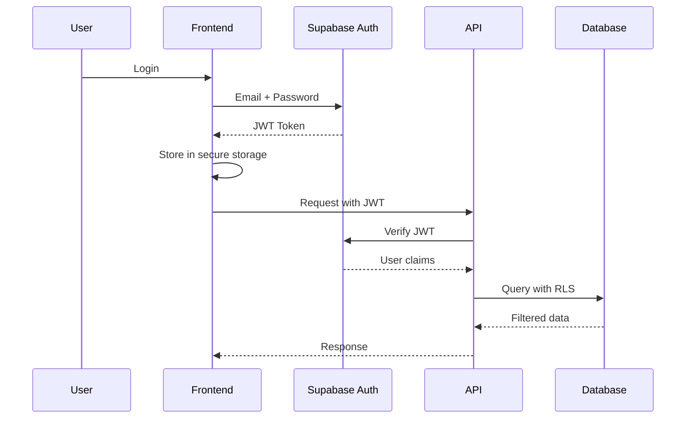

### Row-Level Security (RLS)

```sql
-- Enable RLS on all tables
ALTER TABLE projects ENABLE ROW LEVEL SECURITY;
ALTER TABLE entities ENABLE ROW LEVEL SECURITY;
ALTER TABLE relationships ENABLE ROW LEVEL SECURITY;

-- Policy: Users can only see their own projects
CREATE POLICY "Users can view own projects"
  ON projects FOR SELECT
  USING (auth.uid() = user_id);

-- Policy: Users can only modify their own entities
CREATE POLICY "Users can modify own entities"
  ON entities FOR ALL
  USING (
    project_id IN (
      SELECT id FROM projects WHERE user_id = auth.uid()
    )
  );

-- Policy: Read-only sharing (future feature)
CREATE POLICY "Users can view shared projects"
  ON projects FOR SELECT
  USING (
    id IN (
      SELECT project_id FROM project_shares
      WHERE shared_with_user_id = auth.uid()
    )
  );
```

### API Security

```typescript
// Middleware: Verify JWT
async function authMiddleware(req, res, next) {
  const token = req.headers.authorization?.split(' ')[1];
  
  if (!token) {
    return res.status(401).json({ error: 'Unauthorized' });
  }
  
  try {
    const { data: user, error } = await supabase.auth.getUser(token);
    if (error) throw error;
    
    req.user = user;
    next();
  } catch (error) {
    res.status(401).json({ error: 'Invalid token' });
  }
}

// Middleware: Rate limiting
const rateLimit = rateLimit({
  windowMs: 15 * 60 * 1000,  // 15 minutes
  max: 100,  // Limit each IP to 100 requests per window
  standardHeaders: true,
  legacyHeaders: false,
});

app.use('/api/', rateLimit);
```

### Data Encryption

- **At Rest:** Supabase encrypts all data at rest with AES-256
- **In Transit:** TLS 1.3 for all API communication
- **Sensitive Fields:** Password hashing with bcrypt (cost factor 12)
- **AI API Keys:** Stored in environment variables, never in database

---

## Deployment Architecture

### Infrastructure Diagram

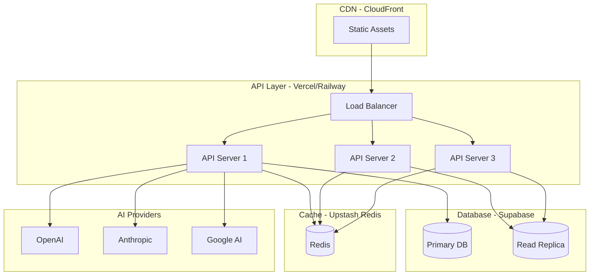

### Deployment Environments

| Environment | Purpose | Infrastructure | Cost |
|------------|---------|----------------|------|
| **Local** | Development | Docker Compose | $0 |
| **Preview** | PR previews | Vercel Preview | $0 (included) |
| **Staging** | QA testing | Supabase + Vercel | ~$50/mo |
| **Production** | Live users | Supabase Pro + Vercel Pro | ~$200/mo |

### CI/CD Pipeline

```yaml
# GitHub Actions workflow
name: Deploy

on:
  push:
    branches: [main]
  pull_request:
    branches: [main]

jobs:
  test:
    runs-on: ubuntu-latest
    steps:
      - uses: actions/checkout@v3
      - name: Run tests
        run: npm test
      
  deploy-preview:
    if: github.event_name == 'pull_request'
    runs-on: ubuntu-latest
    steps:
      - uses: actions/checkout@v3
      - name: Deploy to Vercel Preview
        run: vercel deploy --token=${{ secrets.VERCEL_TOKEN }}
  
  deploy-production:
    if: github.ref == 'refs/heads/main'
    needs: test
    runs-on: ubuntu-latest
    steps:
      - uses: actions/checkout@v3
      - name: Deploy to Vercel Production
        run: vercel deploy --prod --token=${{ secrets.VERCEL_TOKEN }}
      - name: Run migrations
        run: npm run migrate
```

---

## Technology Stack Decisions

### Summary Table

| Layer | Technology | Alternatives Considered | Decision Rationale |
|-------|-----------|------------------------|-------------------|
| **Frontend Framework** | React 18 + TypeScript | Vue, Svelte, Angular | Largest ecosystem, team expertise |
| **Desktop App** | Electron | Tauri, NW.js | Mature, cross-platform, Web APIs |
| **State Management** | Zustand + TanStack Query | Redux, Jotai, Recoil | Lightweight, excellent DX |
| **Database** | Supabase (PostgreSQL) | Neon, Firebase, MongoDB | Real-time + Auth built-in |
| **ORM/Query Builder** | Supabase Client | Prisma, Drizzle | Native Supabase integration |
| **API Framework** | Node.js + Fastify | Express, Nest.js, Bun | Performance, TypeScript support |
| **AI SDKs** | Native APIs | LangChain, Vercel AI SDK | Full control, no abstraction overhead |
| **Caching** | Upstash Redis | Memcached, DragonflyDB | Serverless-compatible |
| **Search** | PostgreSQL FTS + pgvector | Algolia, Typesense, Meilisearch | No external dependency, cost-effective |
| **Hosting (API)** | Vercel / Railway | AWS, GCP, Render | Zero-config, Git integration |
| **Hosting (Frontend)** | Vercel | Netlify, CloudFlare Pages | Best performance, edge network |
| **Monitoring** | Sentry + Vercel Analytics | Datadog, New Relic | Cost-effective, integrated |

---

## Scalability & Performance

### Performance Targets & Strategies

| Metric | Target | Strategy |
|--------|--------|----------|
| **API P95 Latency** | <150ms | Redis caching, database indexes, connection pooling |
| **Timeline Canvas Load** | <2s (500 events) | Canvas virtualization, progressive rendering |
| **AI Response Time** | <5s | Prompt optimization, response caching, parallel requests |
| **Offline Sync** | <3s (100 ops) | Batch operations, delta sync, indexedDB optimization |
| **Real-time Broadcast** | <500ms | Supabase Realtime WebSockets, efficient diffing |

### Horizontal Scaling

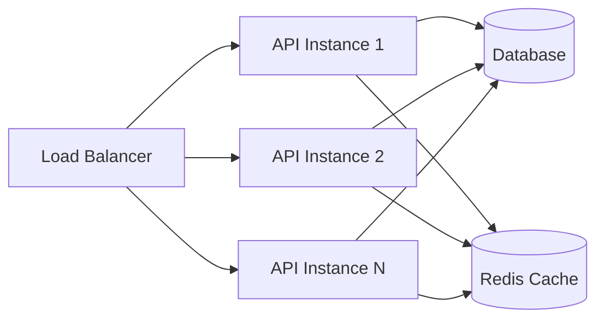

**Scaling Triggers:**
- CPU > 70% sustained → Scale up instances
- Request queue depth > 100 → Scale up instances
- Database connection pool saturation → Add read replicas

### Database Scaling Roadmap

| Stage | Users | Strategy | Cost |
|-------|-------|----------|------|
| **MVP** | <1,000 | Single Supabase instance | $25/mo |
| **Growth** | 1K-10K | Read replicas, Redis cache | $200/mo |
| **Scale** | 10K-100K | Horizontal sharding by project_id | $1K/mo |
| **Enterprise** | >100K | Dedicated database cluster | $5K+/mo |

---

## Appendices

### Appendix A: Database Migrations

```sql
-- Migration: 001_initial_schema.sql
CREATE EXTENSION IF NOT EXISTS "uuid-ossp";
CREATE EXTENSION IF NOT EXISTS "vector";

-- Users table (managed by Supabase Auth)
-- Projects, Entities, Relationships tables (see Data Architecture section)

-- Migration: 002_add_vector_search.sql
ALTER TABLE entities ADD COLUMN embedding vector(1536);
CREATE INDEX idx_entities_embedding ON entities 
USING ivfflat (embedding vector_cosine_ops) WITH (lists = 100);

-- Migration: 003_add_full_text_search.sql
CREATE INDEX idx_entities_search ON entities USING GIN (search_vector);
```

### Appendix B: API Error Codes

| Code | HTTP Status | Description |
|------|------------|-------------|
| `ERR_UNAUTHORIZED` | 401 | Invalid or missing JWT token |
| `ERR_FORBIDDEN` | 403 | User lacks permission for resource |
| `ERR_NOT_FOUND` | 404 | Entity or resource not found |
| `ERR_VALIDATION` | 400 | Request validation failed |
| `ERR_CONFLICT` | 409 | Entity state conflict |
| `ERR_RATE_LIMIT` | 429 | Rate limit exceeded |
| `ERR_AI_PROVIDER` | 503 | AI provider unavailable |
| `ERR_INTERNAL` | 500 | Unexpected server error |

### Appendix C: Monitoring & Observability

```typescript
// Structured logging with Winston
import winston from 'winston';

const logger = winston.createLogger({
  format: winston.format.json(),
  transports: [
    new winston.transports.Console(),
    new winston.transports.File({ filename: 'error.log', level: 'error' }),
    new winston.transports.File({ filename: 'combined.log' }),
  ],
});

// Example log entry
logger.info('Entity updated', {
  userId: 'user-123',
  projectId: 'proj-456',
  entityId: 'char-789',
  operation: 'update',
  duration: 45,  // ms
});

// Metrics collection with Prometheus
const httpRequestDuration = new Histogram({
  name: 'http_request_duration_ms',
  help: 'Duration of HTTP requests in ms',
  labelNames: ['method', 'route', 'status'],
});
```

---

**End of Architecture Document**

*This architecture is designed to evolve. As we validate assumptions during MVP development, we will iterate and refine these designs.*

**Next Steps:**
1. Review and approve this architecture with stakeholders
2. Create detailed component specifications
3. Set up development environment
4. Begin Phase 1: Foundation (Database Schema + Core API)
