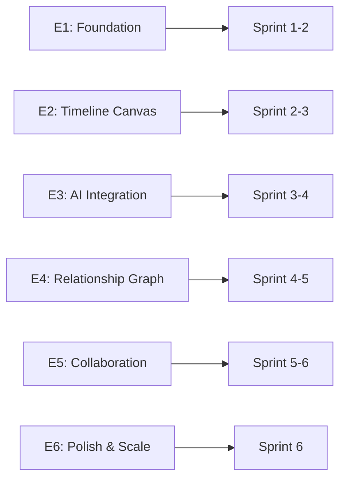

# Chronos: Product Backlog
**Scrum Master Documentation**

**Version:** 1.2  
**Last Updated:** February 12, 2026  
**Sprint Duration:** 2 weeks  
**Total Sprints:** 6 (12 weeks / 60 working days)  
**Team Velocity:** 41 story points avg (Sprints 1-4 actual)

---

## Product Vision

Enable writers to manage complex multi-timeline narratives with absolute consistency, delivering a **working vertical slice** of the system in Sprint 1 that allows users to create, visualize, and manage their first timeline with basic AI assistance.

---

## Definition of Ready (DoR)

A user story is ready for sprint planning when:
- ✅ Acceptance criteria are clear and testable
- ✅ Dependencies are identified
- ✅ Story is sized (story points assigned)
- ✅ Technical approach is understood
- ✅ No blocking impediments

---

## Definition of Done (DoD)

A user story is done when:
- ✅ Code is written and peer-reviewed
- ✅ Unit tests written (>80% coverage)
- ✅ Acceptance criteria met and verified
- ✅ Documentation updated
- ✅ Deployed to staging environment
- ✅ Product Owner has accepted the story

---

## Epic Structure

---

## Epics Overview

| Epic | Description | Business Value | Sprints |
|------|-------------|----------------|---------|
| **E1: Foundation** | Core infrastructure, auth, basic entity CRUD | Critical - Enables all other features | 1-2 |
| **E2: Timeline Visualization** | Interactive timeline canvas with events | High - Core value prop | 2-3 |
| **E3: AI-Powered Intelligence** | Multi-AI integration, idea generation, consistency checking | High - Key differentiator | 3-4 |
| **E4: Relationship Graph** | Dynamic relationships, graph queries, visual connections | Medium - Advanced feature | 4-5 |
| **E5: Real-time Collaboration** | Multi-user editing, conflict resolution | Medium - Future-proofing | 5-6 |
| **E6: Performance & Polish** | Optimization, offline sync, analytics | Medium - Production readiness | 6 |

---

## Complete Product Backlog

### Epic 1: Foundation & Core Infrastructure

#### E1-US1: User Registration and Authentication ✅ *Completed Sprint 1*
**As a** writer  
**I want to** create an account and log in securely  
**So that** my narrative data is private and accessible only to me

**Acceptance Criteria:**
- User can sign up with email/password
- User receives email verification
- User can log in with valid credentials
- Invalid credentials show appropriate error
- JWT token stored securely in client
- Session persists on browser refresh

**Technical Notes:**
- Use Supabase Auth
- Implement JWT token refresh
- Row-level security (RLS) policies

**Story Points:** 5  
**Priority:** P0 (Must Have)  
**Dependencies:** None

---

#### E1-US2: Project Creation and Management ✅ *Completed Sprint 1*
**As a** writer  
**I want to** create and manage multiple narrative projects  
**So that** I can organize different stories independently

**Acceptance Criteria:**
- User can create new project with name and description
- User can view list of all their projects
- User can edit project details
- User can delete project (with confirmation)
- Deleted projects remove all associated entities

**Technical Notes:**
- Projects table with user_id foreign key
- Cascade delete for entities

**Story Points:** 3  
**Priority:** P0  
**Dependencies:** E1-US1

---

#### E1-US3: Character Entity CRUD ✅ *Completed Sprint 1*
**As a** writer  
**I want to** create, edit, and delete character entities  
**So that** I can build my cast of characters

**Acceptance Criteria:**
- User can create character with name, description, biography
- Character properties stored as JSONB (motivations, conflicts)
- User can edit any character field
- User can delete character
- Character list shows all characters in current project
- Search/filter characters by name

**Technical Notes:**
- Use polymorphic entities table
- Implement optimistic UI updates
- IndexedDB caching for offline

**Story Points:** 8  
**Priority:** P0  
**Dependencies:** E1-US2

---

#### E1-US4: Timeline Entity CRUD ✅ *Completed Sprint 1*
**As a** writer  
**I want to** create and manage timeline entities  
**So that** I can organize events across multiple timelines

**Acceptance Criteria:**
- User can create timeline with name, description, tags
- User can set start/end dates (absolute or relative)
- User can edit timeline properties
- User can delete timeline
- Timeline list shows all timelines
- Can mark timeline as "Primary" or "Alternate"

**Story Points:** 5  
**Priority:** P0  
**Dependencies:** E1-US2

---

#### E1-US5: Event Entity CRUD ✅ *Completed Sprint 1*
**As a** writer  
**I want to** create and manage event entities  
**So that** I can document key story moments

**Acceptance Criteria:**
- User can create event with title, description
- User can assign event to one or more timelines
- User can set event timestamp on timeline
- User can link characters to event (participants)
- User can edit/delete events
- Events show in timeline list view

**Story Points:** 8  
**Priority:** P0  
**Dependencies:** E1-US3, E1-US4

---

### Epic 2: Timeline Visualization

#### E2-US1: Basic Timeline Canvas ✅ *Completed Sprint 1*
**As a** writer  
**I want to** see my events on an interactive timeline  
**So that** I can visualize my narrative structure

**Acceptance Criteria:**
- Canvas displays single timeline horizontally
- Events appear as markers on timeline
- Events positioned by timestamp
- User can zoom in/out (date granularity)
- User can pan left/right
- Clicking event shows details sidebar

**Technical Notes:**
- Use D3.js or React Flow
- Canvas virtualization for performance
- Target <2s load for 500 events

**Story Points:** 13  
**Priority:** P0  
**Dependencies:** E1-US5

---

#### E2-US2: Multi-Timeline View — *Sprint 2* ✅ COMPLETED
**As a** writer  
**I want to** view multiple timelines in parallel  
**So that** I can see how different storylines intersect

**Acceptance Criteria:**
- Canvas displays up to 10 timelines vertically stacked
- Each timeline has label and color coding
- Events on each timeline positioned correctly
- User can toggle timeline visibility
- Timelines can be reordered (drag-and-drop)

**Story Points:** 8  
**Priority:** P1  
**Dependencies:** E2-US1

---

#### E2-US3: Event Drag-and-Drop on Timeline — *Sprint 2* ✅ COMPLETED
**As a** writer  
**I want to** drag events to different positions on the timeline  
**So that** I can easily reorganize my narrative

**Acceptance Criteria:**
- User can drag event marker to new timestamp
- Dragging updates event timestamp in database
- Visual feedback during drag (ghost marker)
- Snap-to-grid for precise placement
- Drag latency <50ms

**Story Points:** 5  
**Priority:** P1  
**Dependencies:** E2-US1

---

#### E2-US4: Cross-Timeline Event Indicators
**As a** writer  
**I want to** see when an event spans multiple timelines  
**So that** I understand timeline intersections

**Acceptance Criteria:**
- Events assigned to multiple timelines show connecting lines
- Hover on event highlights all instances across timelines
- Visual indicator (icon) shows cross-timeline events
- Clicking navigates to all timeline instances

**Story Points:** 5  
**Priority:** P2  
**Dependencies:** E2-US2  
**Note:** Superseded by E2-US5 (Timeline Variants), which provides a richer data model. E2-US4's acceptance criteria are delivered as part of E2-US5.

---

#### E2-US5: Timeline Variants — Per-Timeline Entity Overrides — *Sprint 3* ✅ COMPLETED
**As a** writer  
**I want to** define how any entity (character, event, location, arc, theme) differs across timelines  
**So that** I can model divergent realities where the same entity has timeline-specific variations

**Acceptance Criteria:**
- `timeline_variants` table stores per-timeline overrides for any entity type
- Entity detail panel shows a "Timeline Variants" tab listing all timelines with overrides
- Each variant is independently editable (name, description, properties)
- Canvas nodes show a variant indicator (colored dots) when overrides exist
- When a timeline is selected/focused, entities resolve with that timeline's overrides
- Entities without variants display their canonical data unchanged
- Cross-timeline connector lines render for entities shared across swim-lanes (supersedes E2-US4)

**Technical Notes:**
- See [ADR-001: Timeline Variants](../adr/ADR-001-timeline-variants.md)
- Database migration 002: `timeline_variants` table + RLS + indexes
- Frontend merge logic: `resolveEntity(entity, timelineId, variants)`
- Extends existing polymorphic entity model — no schema changes to `entities` table

**Story Points:** 8  
**Priority:** P1  
**Dependencies:** E2-US2 ✅

---

### Epic 3: AI-Powered Intelligence

#### E3-US1: Multi-AI Provider Setup — *Sprint 2* ✅ COMPLETED
**As a** system  
**I want to** support multiple AI providers  
**So that** we have redundancy and cost optimization

**Acceptance Criteria:**
- AI service supports OpenAI, Anthropic, Google
- Provider configured via environment variables
- Circuit breaker pattern for failover
- Failover time <2s
- Cost tracking per provider

**Technical Notes:**
- Build AI abstraction layer
- Implement retry logic
- Cache responses (5 min TTL)

**Story Points:** 8  
**Priority:** P0  
**Dependencies:** None

---

#### E3-US2: AI Model Selection UI — *Sprint 2* ✅ COMPLETED
**As a** writer  
**I want to** choose which AI model to use  
**So that** I can optimize for cost or quality

**Acceptance Criteria:**
- Settings panel shows dropdown of available models
- Can set default model for all operations
- Can override model per feature (idea gen, consistency check)
- Model selection persists in user preferences
- Shows estimated cost per 1K tokens

**Story Points:** 5  
**Priority:** P1  
**Dependencies:** E3-US1

---

#### E3-US3: AI Idea Generation — *Sprint 2* ✅ COMPLETED
**As a** writer  
**I want to** generate creative ideas based on my characters and events  
**So that** I can overcome writer's block

**Acceptance Criteria:**
- User selects character/event and clicks "Generate Ideas"
- AI generates 3-5 relevant plot ideas
- Ideas displayed in sidebar
- User can copy idea to clipboard
- User can save idea as Note entity
- Response time <5s

**Technical Notes:**
- Use contextual prompt templates
- Include linked entities (1-hop) in context
- Target 85% user approval rate

**Story Points:** 13  
**Priority:** P0  
**Dependencies:** E3-US1, E1-US3

---

#### E3-US4: Consistency Checking — *Sprint 3* ✅ COMPLETED
**As a** writer  
**I want to** check my narrative for logical inconsistencies  
**So that** I can avoid plot holes

**Acceptance Criteria:**
- User selects timeline/arc and clicks "Check Consistency"
- AI analyzes events for contradictions
- Results show conflicts with severity (high/medium/low)
- Each conflict has description and suggested fix
- User can accept/reject suggestions

**Story Points:** 13  
**Priority:** P1  
**Dependencies:** E3-US1, E2-US1

---

#### E3-US5: Ripple Effect Analysis (Antigravity Feature) — *Sprint 3* ✅ COMPLETED
**As a** writer  
**I want to** see the impact of changing a critical event  
**So that** I can maintain narrative consistency

**Acceptance Criteria:**
- When user edits event, system analyzes connected entities
- AI identifies conflicts (character arcs, dependent events)
- System proposes specific changes to resolve conflicts
- User can preview changes before applying
- Ripple analysis completes in <3s for 100 linked entities

**Technical Notes:**
- Graph traversal to find related entities
- Batch AI requests for performance
- Show diff view for proposed changes

**Story Points:** 21  
**Priority:** P1  
**Dependencies:** E3-US4, E4-US1

---

### Epic 4: Relationship Graph

#### E4-US1: Create Custom Relationships ✅ *Completed Sprint 4*
**As a** writer  
**I want to** define custom relationships between entities  
**So that** I can capture nuanced story connections

**Acceptance Criteria:**
- User can drag one entity onto another to create relationship
- Modal prompts for relationship type (user-defined text)
- Can add optional metadata (when, how, impact)
- Relationships stored bidirectionally
- <2 clicks from entity view to create relationship

**Story Points:** 8  
**Priority:** P1  
**Dependencies:** E1-US3, E1-US5

---

#### E4-US2: Relationship Visualization ✅ *Completed Sprint 4*
**As a** writer  
**I want to** see all relationships for an entity  
**So that** I understand its connections

**Acceptance Criteria:**
- Clicking entity shows relationship sidebar
- Lists all connected entities with relationship type
- Grouped by entity type (characters, events, themes)
- Clicking related entity navigates to it
- Shows relationship count badge on entity card

**Story Points:** 5  
**Priority:** P1  
**Dependencies:** E4-US1

---

#### E4-US3: Graph Traversal Queries ✅ *Completed Sprint 4*
**As a** writer  
**I want to** find all entities connected to a character within N hops  
**So that** I can explore my narrative web

**Acceptance Criteria:**
- "Explore Connections" button on entity detail
- User sets depth (1-3 hops)
- Results show graph visualization
- Can filter by relationship type
- Query completes in <200ms for 3 hops

**Technical Notes:**
- Use PostgreSQL recursive CTEs
- Implement graph result caching

**Story Points:** 13  
**Priority:** P2  
**Dependencies:** E4-US1

---

#### E4-US4: Visual Relationship Graph ✅ *Completed Sprint 4*
**As a** writer  
**I want to** see a visual graph of entity connections  
**So that** I can understand complex relationships at a glance

**Acceptance Criteria:**
- Graph view shows entities as nodes, relationships as edges
- Force-directed layout for organic positioning
- Node size reflects importance (connection count)
- Hover shows entity details
- Click node to focus (dim others)
- Can filter by entity type

**Story Points:** 13  
**Priority:** P2  
**Dependencies:** E4-US1

---

### Epic 5: Real-time Collaboration

#### E5-US1: Real-time Updates
**As a** writer  
**I want to** see changes made by collaborators in real-time  
**So that** we can work together seamlessly

**Acceptance Criteria:**
- When another user edits entity, change appears within 500ms
- Updates merge with local state (optimistic UI)
- Visual indicator shows "updated by [user]"
- No full page refresh required

**Technical Notes:**
- Supabase Realtime WebSocket subscriptions
- Implement CRDT-like conflict resolution

**Story Points:** 13  
**Priority:** P2  
**Dependencies:** E1-US3

---

#### E5-US2: Presence Indicators
**As a** writer  
**I want to** see who else is editing the same project  
**So that** we avoid conflicting changes

**Acceptance Criteria:**
- Avatar icons show active users
- Highlight entities being edited by others
- "User X is editing this event" tooltip
- Presence updates within 2s

**Story Points:** 8  
**Priority:** P2  
**Dependencies:** E5-US1

---

#### E5-US3: Conflict Resolution UI
**As a** writer  
**I want to** resolve conflicting edits gracefully  
**So that** no work is lost

**Acceptance Criteria:**
- When conflict detected, modal shows both versions
- Side-by-side diff view
- User can choose version or merge manually
- Critical entities (events, arcs) require manual merge
- Non-critical (notes) use last-write-wins

**Story Points:** 13  
**Priority:** P2  
**Dependencies:** E5-US1

---

### Epic 6: Performance & Polish

#### E6-US1: Offline Mode with Sync Queue
**As a** writer  
**I want to** work offline and sync when reconnected  
**So that** I can write anywhere

**Acceptance Criteria:**
- All CRUD operations work offline (IndexedDB)
- Operations queued for sync
- Visual indicator shows "Offline" mode
- Auto-sync when connection restored
- Sync completes in <3s for 100 operations

**Story Points:** 13  
**Priority:** P1  
**Dependencies:** E1-US3

---

#### E6-US2: Full-Text Search
**As a** writer  
**I want to** search across all entities  
**So that** I can quickly find information

**Acceptance Criteria:**
- Global search bar (always visible)
- Searches name, description, properties
- Results grouped by entity type
- Click result navigates to entity
- Search completes in <100ms

**Technical Notes:**
- PostgreSQL full-text search (GIN index)

**Story Points:** 8  
**Priority:** P1  
**Dependencies:** E1-US3

---

#### E6-US3: Performance Optimization
**As a** developer  
**I want to** meet all performance targets  
**So that** the app feels fast

**Acceptance Criteria:**
- P95 API latency <150ms
- Timeline canvas loads in <2s (500 events)
- Application startup <2s
- Memory footprint <250MB
- All metrics monitored via Sentry

**Story Points:** 8  
**Priority:** P1  
**Dependencies:** All previous stories

---

#### E6-US4: Analytics Dashboard
**As a** writer  
**I want to** see statistics about my narrative  
**So that** I can track my progress

**Acceptance Criteria:**
- Dashboard shows entity counts (characters, events, etc.)
- Timeline coverage chart
- Character involvement graph
- Word count over time
- AI usage metrics

**Story Points:** 5  
**Priority:** P3  
**Dependencies:** E1-US3

---

## Story Point Estimation Guide

| Points | Complexity | Examples |
|--------|-----------|----------|
| **1-2** | Trivial | Simple UI changes, config updates |
| **3-5** | Simple | Basic CRUD, simple forms |
| **8** | Medium | Feature with backend + frontend |
| **13** | Complex | Multi-component feature, AI integration |
| **21** | Very Complex | Major architectural feature |

---

## Backlog Summary

| Epic | Total Story Points | Stories |
|------|-------------------|---------|
| **E1: Foundation** | 29 | 5 |
| **E2: Timeline Visualization** | 31 | 4 |
| **E3: AI Integration** | 60 | 5 |
| **E4: Relationship Graph** | 39 | 4 |
| **E5: Collaboration** | 34 | 3 |
| **E6: Performance** | 34 | 4 |
| **TOTAL** | **227** | **25** |

**Estimated Duration:** 6 sprints × 2 weeks = 12 weeks (60 working days)  
**Average Velocity:** 227 ÷ 6 = ~38 story points/sprint

---

## Prioritization Framework

**P0 (Must Have):** Required for MVP launch  
**P1 (Should Have):** Important but can be phased  
**P2 (Could Have):** Good to have, lower priority  
**P3 (Won't Have in MVP):** Post-MVP features

---

**Next Document:** See `sprint-plan.md` for detailed sprint breakdown and deliverables.
