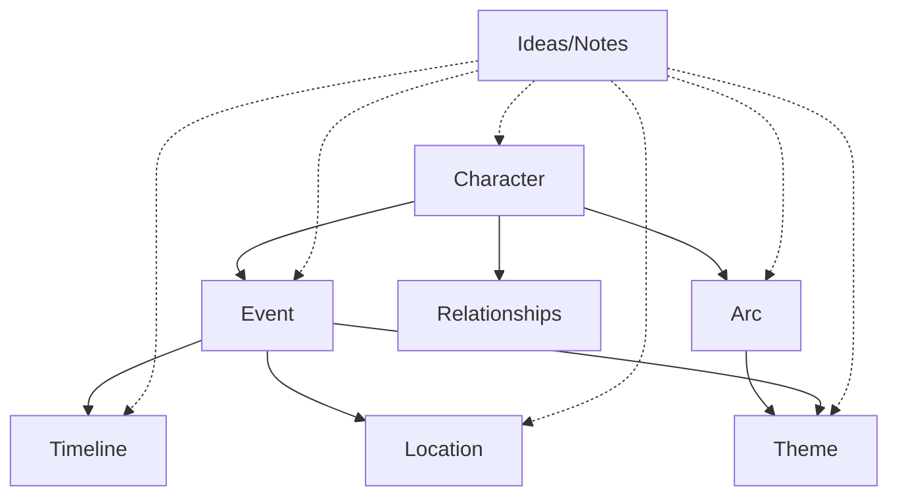
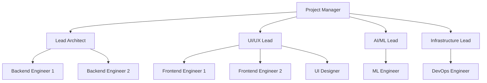
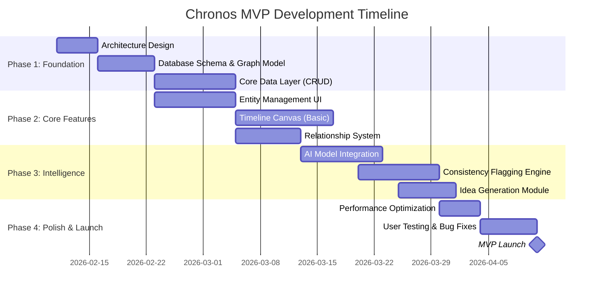

# Project Charter: Chronos
## Narrative Complexity Management System

**Document Version:** 1.0  
**Date:** February 10, 2026  
**Project Codename:** Chronos  
**Classification:** Core Infrastructure  
**Approval Status:** Draft

---

## Executive Summary

**Chronos** is a specialized intelligence layer designed to eliminate narrative chaos in multi-timeline, multi-character epic storytelling. Unlike generic note-taking applications, Chronos operates as a **structured knowledge graph** that understands and enforces narrative consistency across 10+ parallel timelines, preventing plot holes, character inconsistencies, and temporal paradoxes.

**The Problem:** Writers managing complex narratives with multiple timelines face exponential complexity. Standard tools are linear and passive—they store notes but don't understand relationships, can't detect contradictions, and provide zero intelligence about narrative integrity.

**The Solution:** A graph-based system where every story element (character, event, timeline, theme) is a queryable node with explicit relationships. Combined with AI-powered consistency analysis, this creates a **real-time narrative debugger** that allows writers to experiment with radical changes while maintaining systemic coherence.

**Business Value:** First-to-market for extreme multi-timeline narrative management. No comparable solution exists for this level of complexity and integration.

---

## Project Vision & Strategic Objectives

### Vision Statement
Build the definitive tool for managing narrative complexity at scale—enabling writers to create interconnected, multi-timeline epics with absolute consistency and zero cognitive overhead.

### Strategic Objectives

| Objective | Success Metric | Business Impact |
|-----------|---------------|-----------------|
| **Eliminate Narrative Chaos** | 95% reduction in timeline contradictions | Core value proposition |
| **Accelerate Story Creation** | 3x faster ideation and consistency checking | Market differentiator |
| **Scale to Extreme Complexity** | Support 10+ timelines, 10,000+ entities | Unique positioning |
| **Achieve Tool Transparency** | <30s task completion, >85 SUS score | User retention |

---

## Project Scope

### In Scope

#### Core System Components
1. **Knowledge Graph Engine** - Relational database with node/edge architecture
2. **Entity Management System** - CRUD for 7 core entity types
3. **Multi-Timeline Visualization** - Interactive canvas with parallel timeline display
4. **AI Consistency Engine** - Automated conflict detection and resolution suggestions
5. **Relationship Management** - Dynamic user-defined relationship types
6. **Cloud-First Architecture** - Real-time collaboration with offline caching
7. **Multi-AI Model Support** - Seamless switching between OpenAI, Anthropic, Google, and local models

#### MVP Deliverables (60-Day Timeline)
- Core relational data model with graph traversal
- Entity creation/editing for all 7 types
- Basic timeline visualization (10 timelines, 500 events)
- Multi-AI model integration with easy toggle system
- Initial AI contextualization for idea generation
- Automated consistency flagging
- Cloud database with offline caching

### Out of Scope (Post-MVP)
- Collaborative multi-user editing
- Mobile applications
- Export to screenplay/novel formats
- Advanced AI features (dialogue generation, character personality modeling)
- Integration with writing software (Scrivener, Final Draft)
- Version control/branching for narrative alternatives

### Boundary Conditions
- **Dataset Limits (MVP):** 10,000 entities, 20,000 relationships
- **Timeline Limits (MVP):** 10 parallel timelines
- **Performance Floor:** All operations <100ms for MVP dataset size
- **Platform:** Desktop-first (macOS, Windows, Linux)

---

## Technical Architecture & Requirements

### R1: Integrated Knowledge Graph (Foundation)

> [!IMPORTANT]
> This is the architectural foundation. All other features depend on this implementation.

**Requirement:** Graph-like or highly relational database structure where entities are nodes and connections are explicit, searchable edges.

**Technical Specification:**
- Database: Cloud-native PostgreSQL (Neon or Supabase)
- Schema: Relational with adjacency list patterns for graph-like operations
- Query language: SQL with recursive CTEs for graph traversal
- Indexing: Full-text search on all entity properties (PostgreSQL FTS)
- Real-time: Supabase real-time subscriptions for collaborative features
- Schema: Dynamic JSONB columns for custom attributes

**Performance Metrics:**
- CRUD operations: <100ms for datasets up to 10,000 entities/20,000 relationships
- Graph traversal queries: <200ms for 3-hop relationship queries
- Full-text search: <150ms across all entities

**Owner:** Lead Architect  
**Priority:** P0 (Blocking)

---

### R2: Data Entities & Relationship Management

**Core Entity Types:**



#### Entity Schemas

**1. Characters**
- `id`, `name`, `biography`, `motivations`
- `relationships` (to other characters, factions)
- `arc_notes`, `timeline_presence` (array)
- `internal_conflicts`, `created_at`, `updated_at`

**2. Timelines**
- `id`, `name`, `description`
- `start_date`, `end_date` (absolute or relative)
- `tags` (e.g., "Primary Reality", "Flashback", "Alternate Future")
- `branching_point` (reference to parent timeline)

**3. Events/Situations**
- `id`, `title`, `description`
- `participants` (array of character IDs)
- `timeline_ids` (array - supports multi-timeline events)
- `timestamp` (when it occurs on timeline)
- `impact_level`, `resolution_status`
- `linked_themes`, `location_id`

**4. Arcs**
- `id`, `name`, `type` (character/plot/thematic)
- `start_event_id`, `end_event_id`
- `key_turning_points` (array of event IDs)
- `associated_characters`, `associated_themes`

**5. Themes**
- `id`, `keyword`, `description`
- `linked_entities` (characters, events, arcs, timelines)

**6. Locations**
- `id`, `name`, `description`
- `associated_events`, `associated_timelines`

**7. Ideas/Notes**
- `id`, `content` (rich text)
- `linked_entities` (any entity type)
- `tags`, `created_at`

**Dynamic Relationships:**

```typescript
interface Relationship {
  id: string;
  source_entity_type: EntityType;
  source_entity_id: string;
  target_entity_type: EntityType;
  target_entity_id: string;
  relationship_type: string; // User-defined (e.g., "Betrays", "Causes", "Influences")
  metadata?: Record<string, any>; // Optional context
  created_at: Date;
}
```

**Requirements:**
- User can define custom relationship types
- Relationship creation: <2 clicks from entity view
- Bidirectional relationship queries (find all entities related to X)

**Owner:** Core Engineering / Database Lead  
**Priority:** P0 (Blocking)

---

### R3: Multi-Timeline & Multi-Storyline Visualization

**Requirement:** Interactive timeline canvas for visual narrative management.

**UI Components:**

1. **Timeline Canvas**
   - Horizontal axis: Time (zoomable, pannable)
   - Vertical axis: Multiple parallel timelines
   - Event markers: Positioned on timeline(s)
   - Visual indicators: Character involvement, theme presence

2. **Cross-Timeline Tracking**
   - Connecting lines for multi-timeline events
   - Character journey visualization (filter by character)
   - Timeline branching points (visual tree structure)

3. **Conflict & Consistency Flagging**
   - Visual warnings for paradoxes (red highlights)
   - Inconsistency tooltips with details
   - One-click navigation to conflicting entities

**Consistency Detection Rules:**
- Character presence conflicts (same character, same time, different locations)
- Causal contradictions (Event A causes Event B, but B precedes A)
- Timeline branching violations (event on child timeline contradicts parent)
- Character arc breaks (key motivation change without arc update)

**Performance Metrics:**
- Canvas load time: <2s (10 timelines, 500 events)
- Event drag/drop latency: <50ms
- Zoom/pan responsiveness: 60fps

**Owner:** UI Lead / Frontend Architect  
**Priority:** P0 (MVP Core Feature)

---

### R4: AI-Powered Narrative Intelligence

> [!WARNING]
> AI accuracy directly impacts user trust. 85% accuracy threshold is non-negotiable.

**Requirement:** Context-aware AI assistant for narrative generation and consistency analysis.

#### 4.0 Multi-Model AI System

> [!IMPORTANT]
> The system must support multiple AI providers with seamless switching to ensure availability, cost optimization, and feature comparison.

**Functionality:**
- **Supported Models:**
  - OpenAI (GPT-4, GPT-4 Turbo, GPT-3.5)
  - Anthropic (Claude 3.5 Sonnet, Claude 3 Opus, Claude 3 Haiku)
  - Google (Gemini Pro, Gemini Ultra)
  - Local models (Ollama integration for offline use)

- **Easy Toggle System:**
  - Settings panel with dropdown model selection
  - Per-feature model assignment (e.g., use GPT-4 for consistency checking, Claude for creative generation)
  - Real-time model switching without app restart
  - Model performance metrics display (latency, cost per request)

- **Fallback Chain:**
  - Primary model fails → Automatic fallback to secondary model
  - User-configurable priority order
  - Cost optimization mode (use cheaper models for simple tasks)

**Performance:**
- Model switch latency: <500ms
- Fallback activation: <2s

#### 4.1 Contextual Idea Expansion

**Functionality:**
- User selects entity → AI generates relevant ideas (using selected model)
- Input context: Selected entity + all linked data (1-2 hops)
- Output: Plot twists, character motivations, dialogue snippets, event details

**Example:**
```
User selects: Character "Alice" (linked to Event "Betrayal", Theme "Redemption")
AI generates (via selected model):
- "What if Alice's betrayal was orchestrated by her future self from Timeline B?"
- "Alice's redemption arc could involve sacrificing her memory of Timeline A"
- Dialogue: "I've already lived this moment—in another life, I made the wrong choice."
```

**Performance:** <5s response time (varies by model)

#### 4.2 Consistency & Gap Analysis

**Functionality:**
- User selects arc/timeline/character → AI identifies logical gaps
- Analysis types:
  - **Plot holes:** Missing causal links between events
  - **Under-developed arcs:** Characters with sparse turning points
  - **Thematic inconsistencies:** Events contradicting established themes

**Output Format:**
```json
{
  "gaps": [
    {
      "type": "plot_hole",
      "severity": "high",
      "description": "Event 'Reactor Explosion' has no established cause",
      "suggested_fix": "Add preceding event showing sabotage or introduce technical failure arc"
    }
  ]
}
```

#### 4.3 Automated Tagging & Relationship Suggestion

**Functionality:**
- On entity creation → AI suggests:
  - Relevant tags/themes
  - Potential relationships to existing entities
  - Timeline placement (if applicable)

**Performance:** Real-time (<1s for suggestions during typing)

#### 4.4 Integrated Narrative Consistency Engine (Advanced)

**The "Antigravity" Feature:**

When a user modifies a critical entity (character motivation, event outcome, timeline fact), the system:

1. **Detects Impact:** Graph traversal identifies all directly/indirectly linked entities
2. **Flags Conflicts:** AI scans for logical contradictions arising from the change
3. **Proposes Solutions:** AI generates specific adjustments to resolve conflicts

**Example Workflow:**
```
User changes: Event "Battle of Station X" outcome from "Victory" to "Defeat"
↓
System detects:
- Event "Peace Treaty" (depends on Victory) is now illogical
- Character "Commander Y" arc (promoted after Victory) is broken
- Timeline "Alt-Future" (branched from Victory) is invalidated
↓
AI proposes:
- Replace "Peace Treaty" with "Guerrilla Resistance Campaign"
- Update Commander Y's arc: "Demoted and exiled, seeks redemption"
- Mark Alt-Future timeline as "Collapsed - Requires Rebuild"
```

**Performance Metrics:**
- Ripple analysis: <3s for 100 linked entities
- Solution generation: <5s
- User-facing accuracy: >85% (evaluated via user feedback)

**Owner:** AI/ML Lead  
**Priority:** P0 (Core Differentiator)

---

### R5: User Interface & Experience

**Design Principles:**
1. **Direct Manipulation:** Drag-and-drop for all linking operations
2. **Zero-Click Navigation:** Click entity → see all relationships instantly
3. **Minimalist:** Remove all non-essential UI chrome
4. **Context-First:** UI adapts to selected entity type

**Key UI Flows:**

#### Flow 1: Create Character & Link to Event
```
1. Click "+ Character" → Modal opens
2. Fill name, bio → Auto-save as user types
3. Drag character card onto event in timeline → Relationship modal
4. Select relationship type → Done
Total: ~25 seconds
```

#### Flow 2: Detect & Resolve Consistency Conflict
```
1. System flags event in red → User clicks warning icon
2. Sidebar shows conflict details + linked entities
3. User clicks "AI Suggestions" → AI proposes 3 solutions
4. User selects solution → System applies changes
5. Flag resolves automatically
Total: ~45 seconds
```

**Search Functionality:**
- Global search bar (always visible)
- Instant results as user types (<100ms)
- Filters: Entity type, timeline, theme, date range
- Result preview shows relationships

**Performance Metrics:**
- Task completion time: <30s (average)
- System Usability Scale (SUS): >85
- First-time user onboarding: <5 minutes to productive use

**Owner:** UI/UX Lead  
**Priority:** P0

---

### R6: Performance & Robustness

**Architecture Decision: Cloud-First with Offline Capability**

**Rationale:** 
- Scalability: Cloud database (Neon/Supabase) handles growth seamlessly
- Collaboration: Real-time multi-user editing capabilities
- Backup: Automatic cloud backups and point-in-time recovery
- Accessibility: Access from any device
- Offline Support: Local caching with sync when connection restored

**Technical Implementation:**
- **Primary Database:** Neon or Supabase (PostgreSQL)
  - Neon: Serverless PostgreSQL with auto-scaling and branching for dev/staging
  - Supabase: PostgreSQL + real-time subscriptions + built-in auth
- **Local Caching:** IndexedDB for offline operation
  - Cache recently accessed entities/timelines
  - Queue mutations for sync when online
- **Sync Strategy:** Optimistic UI updates with background sync
  - Conflict resolution: Last-write-wins with manual merge UI for critical entities
  - Real-time updates: Supabase real-time for collaborative features
- **Security:** Row-level security (RLS), AES-256 encryption in transit
- **Connection Resilience:** Automatic reconnection with exponential backoff

**Performance Requirements:**

| Metric | Target | Rationale |
|--------|--------|-----------|
| **Application startup** | <2s | Includes initial DB connection |
| **CRUD operations** | <100ms | Network roundtrip included |
| **Timeline canvas render** | <2s | Acceptable for complex view |
| **AI response** | <5s | Varies by selected model |
| **Data sync (real-time)** | <500ms | Supabase real-time latency |
| **Offline → Online sync** | <3s | For queued operations |
| **Memory footprint** | <250MB | Includes local cache |
| **Executable size** | <75MB | Desktop app with offline support |

**Data Integrity:**
- PostgreSQL ACID compliance
- Neon/Supabase automatic backups (point-in-time recovery)
- Export to JSON (human-readable backup)
- Database constraints enforce referential integrity
- Optimistic locking for concurrent edits

**Owner:** Infrastructure Lead / Core Engineering  
**Priority:** P0

---

## Success Metrics & KPIs

### Product Metrics

| Metric | Target (MVP) | Target (6 Months) | Measurement Method |
|--------|-------------|-------------------|-------------------|
| **Task Completion Time** | <30s | <20s | User session analytics |
| **Consistency Flags Resolved** | 70% | 90% | System telemetry |
| **AI Suggestion Acceptance Rate** | 60% | 75% | User interaction tracking |
| **System Usability Scale (SUS)** | >85 | >90 | Quarterly user survey |
| **Daily Active Users (Writers)** | 50 | 500 | Authentication logs |
| **Average Entity Count per Project** | 500 | 2,000 | Database analytics |

### Technical Metrics

| Metric | Target | Monitoring |
|--------|--------|------------|
| **P95 API Response Time** | <150ms | APM dashboards (includes network) |
| **P95 Database Query Time** | <50ms | Neon/Supabase analytics |
| **Crash Rate** | <0.1% of sessions | Error tracking (Sentry) |
| **Real-time Sync Success Rate** | >99.5% | Supabase metrics |
| **Offline → Online Sync Success** | >99.9% | Sync queue logs |
| **AI Model Latency (avg)** | <5s | AI service telemetry |
| **Model Failover Time** | <2s | AI abstraction layer metrics |

### Business Metrics

| Metric | Target (12 Months) | Notes |
|--------|-------------------|-------|
| **Paying Users** | 1,000 | Freemium model |
| **Monthly Recurring Revenue** | $10K | $10/user/month |
| **Churn Rate** | <5% | Industry benchmark: 7% |
| **Net Promoter Score (NPS)** | >50 | Quarterly survey |

---

## Team Structure & Ownership



### Role Definitions & Accountabilities

| Role | Owner | Primary Responsibilities | Delivery Metrics |
|------|-------|-------------------------|-----------------|
| **Project Manager** | TBD | MVP delivery, stakeholder communication, risk management | On-time delivery, scope control |
| **Lead Architect** | TBD | System design, data model, technology stack | Architecture approval, tech debt <10% |
| **UI/UX Lead** | TBD | Interface design, user flows, usability | SUS >85, task completion <30s |
| **AI/ML Lead** | TBD | AI model selection, prompt engineering, accuracy | AI accuracy >85%, latency <5s |
| **Infrastructure Lead** | TBD | Local storage, sync, performance, deployment | Startup <1s, crash rate <0.1% |
| **Backend Engineers** | TBD | Graph DB implementation, API development | API response <100ms |
| **Frontend Engineers** | TBD | Timeline canvas, entity management UI | Canvas render <2s |
| **ML Engineer** | TBD | Model integration, fine-tuning, inference optimization | Model deployment pipeline |
| **DevOps Engineer** | TBD | Build pipeline, deployment automation, monitoring | Zero-downtime deployments |
| **UI Designer** | TBD | Visual design, iconography, design system | Design handoff completeness |

---

## Timeline & Milestones

### 60-Day MVP Roadmap



### Key Milestones

| Milestone | Date | Deliverables | Success Criteria |
|-----------|------|--------------|------------------|
| **M1: Architecture Approval** | Week 1 | System design doc, tech stack decision | Stakeholder sign-off |
| **M2: Data Layer Complete** | Week 3 | Functional graph DB, CRUD APIs | All entity types functional, <100ms operations |
| **M3: UI Alpha** | Week 5 | Basic entity management, timeline canvas | Can create & visualize 3 timelines, 50 events |
| **M4: AI Integration** | Week 7 | AI idea generation, consistency flagging | 75% accuracy, <5s response |
| **M5: Internal Beta** | Week 8 | Feature-complete MVP | 5 internal users test for 1 week |
| **M6: MVP Launch** | Week 9 | Polished, tested application | All P0 requirements met |

### Post-MVP Roadmap (Months 3-6)

- Advanced AI features (character personality modeling, dialogue generation)
- Collaborative editing (real-time multi-user)
- Mobile companion app (iOS/Android)
- Export to screenplay/novel formats
- Integration with Scrivener, Final Draft

---

## Risk Assessment & Mitigation

### Critical Risks

| Risk | Probability | Impact | Mitigation Strategy | Owner |
|------|------------|--------|---------------------|-------|
| **Database latency impacts UX** | Medium | High | Use Neon's edge regions, implement aggressive caching, optimistic UI updates | Lead Architect |
| **AI provider outage** | Medium | Medium | Multi-provider architecture with automatic failover, <2s failover time | AI/ML Lead |
| **AI accuracy below 85% threshold** | Medium | High | Test multiple models, use ensemble approach, allocate 2 weeks for prompt tuning | AI/ML Lead |
| **Timeline canvas performance fails** | Low | High | Use Canvas API with virtualization, limit initial render to viewport | Frontend Lead |
| **Scope creep delays MVP** | High | Medium | Freeze scope after Week 1, defer all non-P0 features | Project Manager |
| **Cloud database cost overruns** | Medium | Medium | Set up billing alerts, implement query optimization early, use Neon's autoscaling | Infrastructure Lead |
| **Offline sync conflicts corrupt data** | Low | High | Implement optimistic locking, conflict resolution UI, database constraints | Infrastructure Lead |
| **Supabase/Neon service degradation** | Low | High | Hot standby on alternative provider, daily automated backups to S3 | Infrastructure Lead |

### Assumptions

> [!CAUTION]
> These assumptions must be validated during Phase 1. Failure invalidates timeline.

1. **Technical Assumptions:**
   - Neon/Supabase can achieve <100ms query performance for MVP dataset size with proper indexing
   - PostgreSQL recursive CTEs perform adequately for graph traversal (up to 5 hops)
   - Multiple AI providers (OpenAI, Anthropic, Google) maintain >99% uptime collectively
   - Modern LLMs (GPT-4, Claude, Gemini) can achieve 85% accuracy for narrative tasks with proper prompting
   - IndexedDB can cache 1,000+ entities locally for offline use without performance issues

2. **Resource Assumptions:**
   - Full team (9 people) available from Day 1
   - Team has expertise in graph databases, React/Electron, AI/ML integration
   - Access to production-grade LLM APIs (OpenAI, Anthropic)

3. **User Assumptions:**
   - Target users are writing complex multi-timeline narratives (sci-fi, fantasy epics)
   - Users willing to invest 5 minutes in onboarding for powerful tool
   - Desktop application acceptable for MVP (mobile not required)

---

## Dependencies & Constraints

### External Dependencies

| Dependency | Provider | Risk Level | Contingency |
|------------|----------|------------|-------------|
| **Cloud Database** | Neon/Supabase | Medium | Hot standby on alternative provider, daily backups |
| **LLM APIs (Multiple)** | OpenAI/Anthropic/Google | Medium | Multi-provider architecture eliminates single point of failure |
| **Real-time Infrastructure** | Supabase | Low | Implement polling fallback if WebSocket fails |
| **Local AI (Optional)** | Ollama | Low | Offline-only feature, not critical for core functionality |

### Technical Constraints

- **Platform:** Desktop-first (macOS, Windows, Linux); Web app (progressive web app)
- **Offline Requirement:** Core features available offline with local cache
- **Browser Compatibility:** Chrome/Firefox/Safari/Edge (latest 2 versions)
- **Minimum Hardware:** 8GB RAM, 500MB disk space (local cache)
- **Network:** Broadband connection recommended; works on 3G+ with degraded performance

### Budget Constraints

- **Development Budget:** $165K (60-day MVP)
  - Team salaries: $120K
  - Cloud Infrastructure (Neon/Supabase): $8K
  - AI APIs (OpenAI, Anthropic, Google): $12K
  - Design/UX tools: $5K
  - Monitoring/DevOps tools: $5K
  - Contingency: $15K

---

## Acceptance Criteria (Definition of Done)

### MVP Launch Criteria

**Functional Requirements (All P0 Met):**
- ✅ User can create/edit/delete all 7 entity types
- ✅ User can define custom relationships between any entities
- ✅ Timeline canvas displays 10 timelines with 500+ events (<2s load)
- ✅ AI generates contextual ideas with >85% user approval rate
- ✅ System automatically flags timeline/character inconsistencies
- ✅ All CRUD operations complete in <100ms
- ✅ Application starts in <2s (cloud connection included)
- ✅ Multi-AI model switching functional with <500ms latency
- ✅ Data persists locally with crash recovery

**Quality Requirements:**
- ✅ System Usability Scale (SUS) >85 (n=10 beta testers)
- ✅ Zero critical bugs (data corruption, crashes on core flows)
- ✅ <5 high-priority bugs at launch
- ✅ All core flows tested with automated E2E tests

**Documentation Requirements:**
- ✅ User onboarding tutorial (5-minute video)
- ✅ In-app contextual help for all major features
- ✅ Technical documentation for architecture, API, database schema

**Performance Requirements:**
- ✅ All performance metrics met (see R6)
- ✅ Load testing validated with 10,000 entities, 20,000 relationships

---

## Communication & Governance

### Stakeholder Communication

| Audience | Frequency | Format | Content |
|----------|-----------|--------|---------|
| **Executive Sponsor** | Weekly | Email update | Milestone progress, risks, budget |
| **Product Team** | Daily | Standup (15 min) | Blockers, completed work, next actions |
| **Beta Users** | Bi-weekly | In-app survey | Feature feedback, bug reports |

### Decision-Making Framework

| Decision Type | Authority | Escalation Path |
|--------------|-----------|-----------------|
| **Technical architecture** | Lead Architect + PM | Executive Sponsor (if budget/timeline impact) |
| **Scope changes** | PM (if <3 day impact), Exec Sponsor (if >3 days) | Board (if >2 weeks delay) |
| **UI/UX changes** | UI Lead + PM | Executive Sponsor (if impacts launch) |

### Status Reporting

**Weekly Progress Report (Fridays):**
- Milestone progress (% complete)
- Completed deliverables
- Blockers & risks
- Next week priorities
- Budget burn rate

---

## Approval & Sign-Off

This project charter requires approval from the following stakeholders:

| Role | Name | Signature | Date |
|------|------|-----------|------|
| **Executive Sponsor** | _____________ | _____________ | _______ |
| **Project Manager** | _____________ | _____________ | _______ |
| **Lead Architect** | _____________ | _____________ | _______ |
| **Finance (Budget Approval)** | _____________ | _____________ | _______ |

---

## Appendices

### Appendix A: Technology Stack (Recommended)

| Layer | Technology | Rationale |
|-------|------------|-----------|
| **Frontend** | React + TypeScript | Component reusability, type safety |
| **UI Framework** | Electron / PWA | Cross-platform desktop + web access |
| **Timeline Canvas** | D3.js / React Flow | Powerful visualization, customizable |
| **Cloud Database** | **Neon or Supabase (PostgreSQL)** | Serverless, auto-scaling, real-time capabilities |
| **Graph Queries** | Recursive CTEs + adjacency lists | Native SQL, performant for relationship traversal |
| **AI Integration** | **Multi-provider SDK** | OpenAI, Anthropic, Google, Ollama support |
| **AI Abstraction Layer** | Custom TypeScript SDK | Unified interface for multiple models |
| **Real-time Sync** | Supabase Realtime / Polling | Collaborative features, optimistic UI |
| **Local Cache** | IndexedDB + Dexie.js | Offline support, fast reads |
| **State Management** | Zustand / TanStack Query | Server state + local state management |
| **Testing** | Jest + Playwright | Unit + E2E coverage |

### Appendix B: User Personas

**Primary Persona: "The Epic World-Builder"**
- **Background:** Writing sci-fi/fantasy series with 5+ timelines
- **Pain Points:** Loses track of character arcs, creates plot holes, spends hours cross-referencing notes
- **Goals:** Maintain consistency, experiment with narrative changes safely
- **Tech Savviness:** High (uses Scrivener, Notion, spreadsheets)

**Secondary Persona: "The Screenwriter"**
- **Background:** Developing TV series with flashbacks and alternate realities
- **Pain Points:** Difficult to visualize how timelines intersect, hard to communicate structure to collaborators
- **Goals:** Visual timeline representation, export to Final Draft

### Appendix C: Glossary

- **Entity:** Any story element (character, event, timeline, etc.) stored as a discrete node
- **Relationship/Edge:** A defined connection between two entities
- **Knowledge Graph:** The complete network of entities and relationships
- **Timeline Canvas:** The primary UI for visualizing events across multiple timelines
- **Consistency Flagging:** Automated detection of plot holes or contradictions
- **Ripple Effect:** The cascading changes that occur when a critical entity is modified

---

**End of Project Charter**

*"The crater's yours if you fail to deliver on the integration and performance metrics."*  
— Project Sponsor
