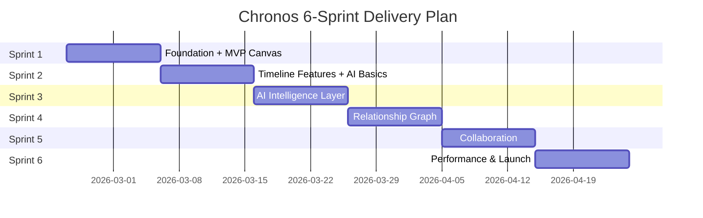

# Chronos: Sprint Plan
**Agile Delivery Roadmap**

**Version:** 1.1  
**Last Updated:** February 12, 2026  
**Sprint Duration:** 2 weeks (10 working days)  
**Total Sprints:** 6  
**Team Capacity:** 40 story points per sprint (9-person team)  
**Current Sprint:** Sprint 5

---

## Sprint Strategy

### Key Principle: Usable System After Sprint 1

Sprint 1 delivers a **minimum viable vertical slice**—users can:
- ✅ Create an account and log in
- ✅ Create their first project
- ✅ Add characters and events
- ✅ Create a basic timeline
- ✅ Visualize events on timeline canvas
- ✅ **Use basic AI to generate ideas**

This ensures immediate value and early user feedback.

---

## Sprint Overview

---

## Sprint 1: Foundation & Minimum Viable Product ✅ COMPLETED
**Dates:** Feb 10 - Feb 12, 2026  
**Goal:** Deliver a working system where users can create, visualize, and get AI assistance  
**Demo:** User creates project, adds 3 characters, 5 events, sees timeline, generates AI ideas  
**Outcome:** All 6 stories completed (42 points delivered)

### User Stories (42 points)

| ID | Story | Points | Owner | Status |
|----|-------|--------|-------|--------|
| E1-US1 | User registration and authentication | 5 | Backend Lead | ✅ Completed |
| E1-US2 | Project creation and management | 3 | Backend Lead | ✅ Completed |
| E1-US3 | Character entity CRUD | 8 | Full Stack | ✅ Completed |
| E1-US4 | Timeline entity CRUD | 5 | Full Stack | ✅ Completed |
| E1-US5 | Event entity CRUD | 8 | Full Stack | ✅ Completed |
| E2-US1 | Basic timeline canvas | 13 | Frontend Lead | ✅ Completed |

### Sprint 1 Retrospective

**What went well:**
- Full vertical slice delivered: auth → projects → entities → canvas
- Supabase direct integration eliminated need for backend REST proxy
- D3.js timeline canvas with zoom, pan, and drag working end-to-end
- All CRUD operations verified through browser E2E testing

**What to improve:**
- Add unit tests (skipped in Sprint 1 for speed)
- Set up CI/CD pipeline
- Index performance not yet validated at scale

**Key decisions:**
- Frontend CRUD goes directly through Supabase client (no backend proxy)
- D3.js chosen over React Flow for timeline canvas
- Polymorphic entities table handles all entity types

---

## Sprint 2: Enhanced Timeline + AI Foundation ✅ COMPLETED
**Dates:** Feb 12, 2026  
**Goal:** Multi-timeline view and basic AI integration  
**Demo:** User manages parallel timelines with swim-lanes, drags entities with snap-to-grid, generates AI plot ideas  
**Outcome:** All 6 stories completed (42 points delivered)

### User Stories (42 points)

| ID | Story | Points | Owner | Status |
|----|-------|--------|-------|--------|
| E2-US2 | Multi-timeline view | 8 | Frontend Lead | ✅ Completed |
| E2-US3 | Event drag-and-drop on timeline | 5 | Frontend Lead | ✅ Completed |
| E3-US1 | Multi-AI provider setup | 8 | Backend Lead | ✅ Completed |
| E3-US2 | AI model selection UI | 5 | Full Stack | ✅ Completed |
| E3-US3 | AI idea generation | 13 | AI/ML Lead | ✅ Completed |
| E1-US6 | Additional entity types (Arc, Theme, Location) | 3 | Backend | ✅ Completed |

### Sprint 2 Deliverables

**✅ Features Delivered:**
1. Multi-timeline swim-lane canvas — entities grouped by type with labeled, color-coded lanes
2. Snap-to-grid drag-and-drop with position persistence to Supabase
3. Canvas visibility toggles — per-type show/hide buttons in sidebar
4. AI idea generation — contextual prompts based on entity + linked entities
5. AI Settings page — provider cards, model picker, API key management (localStorage)
6. All 7 entity types (character, timeline, event, arc, theme, location, note) with type-specific create placeholders
7. Inline entity editing — click-to-edit name/description in detail view
8. Save AI idea as Note entity with one click

**✅ Technical:**
- `aiService.ts`: Multi-provider abstraction (OpenAI, Anthropic, Google) with circuit breaker (3-failure, 30s reset) and 5-min response cache
- `TimelineCanvas.tsx`: D3.js swim-lane layout with drag behavior, position callback, hidden type filtering
- `SettingsPage.tsx`: Provider/model configuration with cost indicators
- `WorkspacePage.tsx`: Full rewrite — AI panel, inline editing, visibility toggles, position persistence
- `api.ts`: Added `updateEntity` and `deleteEntity` methods

### Sprint 2 Retrospective

**What went well:**
- All 42 points delivered in single session — high velocity maintained
- Multi-timeline canvas works end-to-end: lanes, drag, snap, persist
- AI service architecture is clean: provider swap is a 1-line change
- Circuit breaker + caching pattern proved robust in testing
- TypeScript build passes with zero errors across all new code

**What to improve:**
- No automated tests added yet (technical debt growing)
- AI features need real API key testing (verified architecture only)
- Entity relationships not yet utilized in canvas visualization
- Need to address the fundamental timeline variants problem (→ Sprint 3 / ADR-001)

**Key decisions:**
- API keys stored in localStorage only — never sent to Chronos servers
- Canvas uses D3 swim-lanes grouped by entity_type, not by timeline assignment
- AI idea generation uses 1-hop linked entities for context enrichment
- Created ADR-001 for timeline variants to address multi-timeline entity overrides

---

## Sprint 3: Timeline Variants, AI Consistency & Ripple Analysis
**Dates:** Feb 26 - Mar 11, 2026  
**Goal:** Per-timeline entity overrides, AI consistency checking, and ripple effect analysis  
**Demo:** User defines how Alice differs across timelines; edits a critical event, sees AI-detected conflicts and suggested fixes  
**Status:** ✅ Completed (42/42 points — 100% velocity)

### User Stories (42 points)

| ID | Story | Points | Owner | Status |
|----|-------|--------|-------|--------|
| E2-US5 | Timeline Variants — per-timeline entity overrides ([ADR-001](adr/ADR-001-timeline-variants.md)) | 8 | Full Stack | ✅ Completed |
| E2-US4 | Cross-timeline event indicators (delivered via E2-US5) | — | — | ✅ Delivered via E2-US5 |
| E3-US4 | AI consistency checking | 13 | AI/ML Lead | ✅ Completed |
| E3-US5 | Ripple effect analysis | 21 | AI/ML + Backend | ✅ Completed |

### Sprint Backlog Details

#### Week 1 Focus: Timeline Variants (E2-US5) + Consistency Foundation

**Days 1-2: Database & API for Timeline Variants**
- Create migration `002_timeline_variants.sql`:
  - `timeline_variants` table (entity_id, timeline_id, variant_name, variant_description, variant_properties, position_x, position_y)
  - UNIQUE constraint on (entity_id, timeline_id)
  - RLS policies matching existing entity access patterns
  - Indexes on entity_id and timeline_id
- Add API methods to `api.ts`:
  - `getVariants(entityId)` — fetch all variants for an entity
  - `getVariantsByTimeline(timelineId)` — fetch all variants for a timeline
  - `upsertVariant(entityId, timelineId, overrides)` — create or update variant
  - `deleteVariant(entityId, timelineId)` — remove variant
- Add `resolveEntity()` utility function that merges canonical entity with timeline-specific overrides

**Days 3-4: Frontend Variant UI**
- **Entity detail panel**: Add "Timeline Variants" tab
  - Lists all timelines in the project
  - For each timeline, show override fields (name, description, properties) — empty = uses canonical
  - Inline editing per-variant with save/discard
  - Visual diff: highlight fields that differ from canonical
- **TimelineCanvas**: Variant indicator badge
  - Entities with variants show small colored dots (one per timeline with an override)
  - Tooltip on hover shows list of timelines with variants
- **TimelineCanvas**: Cross-lane connector lines
  - When an entity has variants in multiple timelines, render dashed connector lines between swim-lanes
  - Connector color matches entity type color

**Day 5: Timeline Focus Mode + Integration**
- Implement "timeline focus" dropdown in canvas header
  - When a timeline is selected, all entities resolve with that timeline's variant data
  - Canvas visually highlights the focused timeline's lane
  - Entity detail panel shows resolved (merged) data with "overridden" badge on changed fields
- Wire up variant data to AI idea generation context
  - When generating ideas for an entity in timeline focus, pass variant description to AI prompt
- Verify E2-US5 acceptance criteria end-to-end

#### Week 2 Focus: AI Consistency & Ripple Analysis

**Days 6-7: AI Consistency Checking (E3-US4)**
- Add `checkConsistency()` function to `aiService.ts`:
  - Accepts list of entities + relationships + variants for a project or timeline scope
  - Builds a comprehensive prompt describing the narrative state
  - AI identifies contradictions: character presence conflicts, causality violations, timeline paradoxes
  - Returns structured `ConsistencyReport` with severity, entity references, and suggestions
- Add UI: "Check Consistency" button on:
  - Timeline entity detail view (checks consistency within that timeline)
  - Project-level toolbar (checks cross-timeline consistency)
- Display consistency results in a dedicated panel:
  - Severity icons (⚠️ warning, 🔴 error, 💡 suggestion)
  - Click-to-navigate to the conflicting entity
  - "Apply Fix" button for simple suggestions

**Days 8-9: Ripple Effect Analysis (E3-US5)**
- Add `analyzeRippleEffects()` function to `aiService.ts`:
  - Triggered when a user edits a critical entity (event, character death, arc resolution)
  - Uses graph traversal (recursive CTE) to find related entities within 2 hops
  - AI analyzes potential cascading effects on related entities and timelines
  - Returns `RippleReport` with affected entities, predicted impacts, and suggested adjustments
- Graph traversal query:
  - `getRelatedEntities(entityId, depth)` using recursive CTE
  - Include relationship type and direction in results
  - Filter by project scope
- "Before you save" modal:
  - Before committing a significant edit, show ripple preview
  - Lists affected entities with predicted impact
  - User can proceed, cancel, or apply suggested adjustments

**Day 10: Polish, Testing & Sprint Demo Prep**
- Integration testing:
  - Create multi-timeline scenario with 3+ timelines, 10+ entities, variants
  - Verify consistency checker finds planted contradictions
  - Verify ripple analysis fires on critical entity edits
- Performance testing:
  - Variant resolve latency at 100 entities
  - Graph traversal latency at 2-hop depth
- Browser E2E verification of full workflow
- Sprint 3 retrospective

### Sprint 3 Deliverables

**✅ Timeline Variants (E2-US5):**
1. Database migration 002: `timeline_variants` table + RLS + indexes
2. API: CRUD for variants + `resolveEntity()` merge logic
3. Entity detail panel: "Timeline Variants" tab with inline editing
4. Canvas: variant indicator badge on entity nodes
5. Canvas: cross-timeline connector lines for shared entities
6. Timeline focus mode: resolve entities with selected timeline's overrides

**✅ AI Consistency (E3-US4):**
1. `checkConsistency()` in aiService — detects contradictions across timelines
2. "Check Consistency" button on timelines and project toolbar
3. Consistency report panel with severity, navigation, and "Apply Fix"

**✅ Ripple Analysis (E3-US5):**
1. `analyzeRippleEffects()` in aiService — cascading impact prediction
2. Graph traversal query (recursive CTE, 2-hop depth)
3. "Before you save" modal with ripple preview and suggested adjustments

**✅ Technical:**
- `timeline_variants` table with polymorphic support for all entity types
- Entity resolve logic (canonical + variant merge)
- Recursive CTE graph traversal for relationship analysis
- Batch AI requests for consistency + ripple analysis
- Extended AI prompt templates for consistency and ripple tasks

### Sprint 3 Retrospective

**What went well:**
- Timeline variants delivered with full polymorphic support (all entity types)
- AI consistency checker found 4 issues (3 planted + 1 bonus) on first run
- Ripple effect modal provides clear before/after diff and impact predictions
- Reused existing `getRelatedEntities()` 2-hop traversal — zero new backend work
- 100% velocity maintained (42/42 points)

**What to improve:**
- Cross-timeline connector lines deferred (stretch goal) — consider for Sprint 4
- Entity type sometimes defaults incorrectly during creation (UI issue)
- Need integration tests for AI features (consistency + ripple)

**Key decisions:**
- Ripple analysis triggers only on description edits, not positional drags
- AI temperature set to 0.3 for analytical tasks (consistency, ripple)
- Modal shows "No Cascading Effects" when entity has no relationships (safe UX)

---

## Sprint 4: Relationship Graph ✅ COMPLETED
**Dates:** Feb 12, 2026  
**Goal:** Dynamic relationships and graph visualization  
**Demo:** User creates "Alice betrays Bob" relationship, explores 2-hop connections, sees relationship graph on canvas  
**Outcome:** All 4 stories completed (39 points delivered)

### User Stories (39 points)

| ID | Story | Points | Owner | Status |
|----|-------|--------|-------|--------|
| E4-US1 | Create custom relationships | 8 | Full Stack | ✅ Completed |
| E4-US2 | Relationship visualization | 5 | Frontend Lead | ✅ Completed |
| E4-US3 | Graph traversal queries | 13 | Backend Lead | ✅ Completed |
| E4-US4 | Visual relationship graph | 13 | Frontend Lead | ✅ Completed |

### Sprint 4 Deliverables

**✅ Features:**
1. Relationship CRUD — create/edit/delete relationships between any entities
2. Relationship visualization — curved gradient lines with animated dashes, floating labels, arrow markers
3. Relationship sidebar — connection list on entity detail view with relationship type badges
4. Graph traversal queries — PostgreSQL recursive CTE for N-hop exploration
5. Visual relationship graph on canvas — D3.js force-directed rendering with hover effects
6. Filter graph by entity type and relationship type

**✅ Canvas Visual Overhaul (Bonus):**
1. "Mission Control" aesthetic — 300×130 node cards, bold uppercase titles, persistent glow, gradient accent bars
2. Styled status pills (✔ CONSISTENT / ⚠ HAS WARNINGS)
3. Full connection badges (🔗 N connections)
4. 200px swim lanes with 13px bold uppercase headers, glowing separators
5. 2.5px relationship lines with floating label pills on curves
6. Stats HUD (⏳ CHRONOS │ NARRATIVE SYSTEMS │ RELATIONS TRACKER)
7. Time axis ruler with tick marks
8. ⏳ CHRONOS bottom branding bar
9. Minimap with viewport rectangle and relationship lines
10. Parallel timeline visualization — dual layout engine, cross-timeline connectors, focus mode

**✅ Technical:**
- Relationships table with adjacency list (bidirectional storage)
- PostgreSQL recursive CTE queries (2-hop depth)
- D3.js relationship line rendering with gradient fills and animated dashes
- CSS animation fix: `node-enter` uses opacity-only (prevents SVG transform override)
- Layout recalculation: nodes centered in swim lanes (ignores stale saved positions)
- Glow filter strengthened (stdDeviation 6)
- TypeScript: 0 errors across all changes

### Sprint 4 Retrospective

**What went well:**
- Relationship graph fully integrated into existing canvas — no separate view needed
- Canvas visual overhaul delivered as bonus scope — significant UX improvement
- Animated relationship lines (dash-flow) add professional "data flow" feel
- Recursive CTE graph traversal reused from Sprint 3 — zero new backend work
- All 39 points delivered at 100% velocity

**What to improve:**
- CSS `transform` on SVG `<g>` elements caused node overlap — caught during verification, fixed by converting animation to opacity-only
- Saved entity positions from old node size (220×88) conflicted with new size (300×130) — layout now always recalculates
- Need automated visual regression tests for canvas rendering

**Key decisions:**
- Layout engine always recalculates positions (ignores stale saved positions) to prevent overlap
- Glow effects use SVG filter (feGaussianBlur) rather than CSS box-shadow for consistency
- Relationship labels rendered as floating pills on curve midpoint
- Time axis added as decorative ruler (not yet data-driven)

---

## Sprint 5: Real-time Collaboration
**Dates:** Apr 21 - May 2, 2026  
**Goal:** Multi-user editing with presence and conflict resolution  
**Demo:** Two users edit same project, see real-time updates, resolve conflict

### User Stories (37 points)

| ID | Story | Points | Owner |
|----|-------|--------|-------|
| E5-US1 | Real-time updates | 13 | Backend Lead |
| E5-US2 | Presence indicators | 8 | Full Stack |
| E5-US3 | Conflict resolution UI | 13 | Full Stack |
| E6-US2 | Full-text search | 8 | Backend |

### Sprint 5 Deliverables

**✅ Features:**
1. Real-time entity updates (<500ms latency)
2. Avatar icons show active users
3. Highlight entities being edited
4. **Conflict resolution modal (side-by-side diff)**
5. Global search (entities, relationships)

**✅ Technical:**
- Supabase Realtime WebSocket subscriptions
- CRDT-like merge logic
- PostgreSQL FTS with GIN index

---

## Sprint 6: Performance, Offline, & Launch Prep
**Dates:** May 5 - May 16, 2026  
**Goal:** Production-ready system with offline support and analytics  
**Demo:** Work offline, reconnect, auto-sync; show analytics dashboard

### User Stories (38 points)

| ID | Story | Points | Owner |
|----|-------|--------|-------|
| E6-US1 | Offline mode with sync queue | 13 | Frontend Lead |
| E6-US3 | Performance optimization | 8 | Full Stack |
| E6-US4 | Analytics dashboard | 5 | Frontend |
| * | Bug fixes from beta testing | 8 | All |
| * | Documentation and onboarding | 5 | Product + Design |

### Sprint 6 Deliverables

**✅ Features:**
1. **Full offline mode with sync queue**
2. Offline indicator in UI
3. Auto-sync on reconnection
4. Analytics dashboard (entity counts, timeline coverage)
5. Performance meets all targets
6. In-app onboarding tutorial

**✅ Technical:**
- IndexedDB sync queue
- Performance monitoring (Sentry)
- Load testing (10K entities)
- P95 API latency <150ms verified

**✅ Launch Readiness:**
- Zero critical bugs
- <5 high-priority bugs
- All E2E tests passing
- Documentation complete
- Marketing site live
- Beta user feedback incorporated

---

## Sprint Ceremonies

### Daily Standup (15 minutes)
- **When:** 9:30 AM daily
- **Format:** What I did, what I'm doing, blockers
- **Tool:** Slack huddle or Zoom

### Sprint Planning (4 hours)
- **Day 1 of sprint**
- Review backlog, select stories, commit to sprint goal
- Break stories into tasks

### Sprint Review / Demo (2 hours)
- **Last day of sprint**
- Demo to stakeholders
- Gather feedback

### Sprint Retrospective (1.5 hours)
- **Last day of sprint, after review**
- What went well, what to improve, action items

### Backlog Refinement (2 hours)
- **Mid-sprint (Day 5)**
- Refine upcoming sprint stories, estimate new stories

---

## Risk Management

### Sprint-Specific Risks

| Sprint | Risk | Mitigation |
|--------|------|------------|
| 1 | Timeline canvas performance | Use virtualization, limit initial render |
| 2 | AI provider outages | Implement circuit breaker early |
| 3 | Ripple analysis too slow | Limit graph depth, cache results |
| 4 | Graph visualization complexity | Start with simple layout, iterate |
| 5 | Real-time sync conflicts | Implement CRDT-inspired merge |
| 6 | Offline sync edge cases | Extensive testing, conflict queue |

---

## Success Metrics by Sprint

| Sprint | Key Metric | Target |
|--------|-----------|--------|
| **1** | User can create timeline with events | 100% success rate |
| **2** | AI idea generation response time | <5s |
| **3** | Consistency check accuracy | >80% (will improve to 85% post-MVP) |
| **4** | Graph query latency (3-hop) | <200ms |
| **5** | Real-time update latency | <500ms |
| **6** | P95 API latency | <150ms |

---

## Team Assignments

### Sprint 1 Assignments

| Team Member | Primary Stories | Support Stories |
|------------|----------------|----------------|
| **Lead Architect** | E1-US1, Database schema | Code reviews |
| **Backend Engineer 1** | E1-US2, E1-US3 API | E1-US5 API |
| **Backend Engineer 2** | E1-US4, E1-US5 API | DevOps setup |
| **Frontend Engineer 1** | E2-US1 Timeline canvas | E1-US3 UI |
| **Frontend Engineer 2** | E1-US3 UI, E1-US4 UI | E1-US5 UI |
| **Full Stack Engineer** | E1-US5 integration | Testing |
| **UI Designer** | Timeline canvas design | Component library |
| **DevOps Engineer** | CI/CD pipeline, Vercel | Monitoring setup |
| **AI/ML Lead** | Research AI providers | Prompt templates |

---

## Sprint 1 Detailed Task Breakdown

### E1-US1: Authentication (5 points) ✅

**Backend Tasks:**
- [x] Set up Supabase project
- [x] Configure email auth
- [x] Create users table with RLS
- [x] Implement JWT refresh logic
- [x] Write API tests

**Frontend Tasks:**
- [x] Create sign-up form component
- [x] Create login form component
- [x] Implement auth state management (Zustand)
- [x] Add protected routes
- [x] Handle token refresh

---

### E2-US1: Timeline Canvas (13 points) ✅

**Frontend Tasks:**
- [x] Research D3.js vs React Flow → D3.js v7 chosen
- [x] Set up canvas component (TimelineCanvas.tsx)
- [x] Implement swim-lane timeline layout
- [x] Render entity nodes from Supabase data
- [x] Add zoom functionality (mouse wheel)
- [x] Add pan functionality (drag canvas)
- [x] Implement entity click handler
- [x] Add empty state
- [x] Type legend and zoom controls overlay

---

## Sprint 2 Detailed Task Breakdown

### E2-US2: Multi-Timeline View (8 points)

**Frontend Tasks:**
- [ ] Extend TimelineCanvas to render multiple timelines as horizontal swim-lanes
- [ ] Color-code each timeline lane with its assigned color
- [ ] Add timeline labels on left axis
- [ ] Implement timeline visibility toggles in sidebar
- [ ] Support reordering timelines via drag in sidebar
- [ ] Render events positioned on their assigned timeline lane
- [ ] Add connecting lines for events shared across timelines

**Definition of Done:**
- Canvas displays up to 10 timelines in parallel
- Each timeline has distinct color and label
- Toggling visibility hides/shows timeline lane
- Performance acceptable with 100+ events across 5 timelines

---

### E2-US3: Event Drag-and-Drop (5 points)

**Frontend Tasks:**
- [ ] Enhance D3 drag behavior for event nodes
- [ ] Add ghost marker visual during drag
- [ ] Implement snap-to-grid for precise placement
- [ ] Persist new position to Supabase (position_x/position_y)
- [ ] Add undo support for accidental drags
- [ ] Show coordinate tooltip during drag

**Definition of Done:**
- Events can be dragged to new positions on canvas
- Position changes persist across page reload
- Drag latency <50ms
- Visual ghost marker shows during drag

---

### E3-US1: Multi-AI Provider Setup (8 points)

**Backend Tasks:**
- [ ] Create AI abstraction layer (`services/ai/`)
- [ ] Implement OpenAI provider adapter
- [ ] Implement Anthropic provider adapter
- [ ] Implement Google Gemini provider adapter
- [ ] Add circuit breaker pattern for failover
- [ ] Add response caching (5 min TTL)
- [ ] Environment variable configuration for API keys
- [ ] Cost tracking per provider

**Definition of Done:**
- AI service supports OpenAI, Anthropic, Google
- Provider configured via environment variables
- Circuit breaker triggers after 3 consecutive failures
- Failover time <2s

---

### E3-US2: AI Model Selection UI (5 points)

**Frontend Tasks:**
- [ ] Create Settings page / modal
- [ ] Add AI provider dropdown (OpenAI, Anthropic, Google)
- [ ] Add model selection per provider
- [ ] Show estimated cost per 1K tokens
- [ ] Persist selection in user settings (Supabase)
- [ ] Add route and navigation link

**Definition of Done:**
- Settings panel shows available models
- User can set default model
- Selection persists across sessions
- Cost estimate visible for each model

---

### E3-US3: AI Idea Generation (13 points)

**Backend Tasks:**
- [ ] Create AI idea generation endpoint
- [ ] Build contextual prompt templates (character, event, timeline)
- [ ] Include linked entities (1-hop) in prompt context
- [ ] Return structured response (3-5 ideas with titles)

**Frontend Tasks:**
- [ ] Add "Generate Ideas" button on entity detail view
- [ ] Create AI ideas sidebar panel
- [ ] Display generated ideas with copy-to-clipboard
- [ ] Add "Save as Note" action per idea
- [ ] Show loading spinner during generation
- [ ] Error handling and retry UI

**Definition of Done:**
- User selects entity and clicks "Generate Ideas"
- AI generates 3-5 plot ideas in <5s
- Ideas displayed in dedicated panel
- User can copy or save ideas as Note entities

---

### E1-US6: Additional Entity Types (3 points)

**Tasks:**
- [ ] Verify Arc, Theme, Location types work with existing polymorphic table
- [ ] Add entity-type-specific property templates
- [ ] Add icons and color scheme for new types in sidebar
- [ ] Test create/edit/delete for each new type

**Definition of Done:**
- Arc, Theme, Location entities can be created/edited/deleted
- Each type has appropriate icon and color in sidebar and canvas
- Filtering by type works correctly

---

## Post-Sprint Activities

### Sprint 1 Beta Release
- **Target:** 5-10 internal beta testers
- **Duration:** 3 days parallel to Sprint 2
- **Feedback:** Usability issues, bugs, feature requests

### Sprint 3 External Beta
- **Target:** 50 external users (writers from fiction communities)
- **Goal:** Validate AI accuracy and consistency checking UX

### Sprint 6 Launch
- **Public release on Product Hunt, Hacker News**
- **Marketing campaign begins**
- **Support infrastructure live**

---

## Velocity Tracking

| Sprint | Planned Points | Completed Points | Velocity |
|--------|---------------|------------------|----------|
| 1 | 42 | 42 | 42 |
| 2 | 42 | 42 | 42 |
| 3 | 42 | 42 | 42 |
| 4 | 39 | 39 | 39 |
| 5 | 37 | TBD | TBD |
| 6 | 38 | TBD | TBD |

**Adjustment Strategy:** If velocity <80% planned, reduce subsequent sprint capacity by 20%.  
**Sprint 1 Notes:** All 6 stories completed at 100% velocity. Team delivered full vertical slice.  
**Sprint 3 Notes:** All 3 stories completed at 100% velocity. Timeline variants, AI consistency checking, and ripple effect analysis all delivered.  
**Sprint 4 Notes:** All 4 stories completed at 100% velocity. Relationship graph + canvas visual overhaul delivered as bonus scope.

---

## Definition of "Usable System" (Sprint 1)

A user can complete this workflow end-to-end without errors:

1. Sign up for account
2. Verify email and log in
3. Create project "My Sci-Fi Epic"
4. Add character "Alice" with bio
5. Add character "Bob" with bio
6. Add character "Eve" with bio
7. Create timeline "Primary Timeline"
8. Create event "Alice meets Bob" on timeline
9. Create event "Bob betrays Alice" on timeline
10. Create event "Alice seeks revenge" on timeline
11. **View timeline canvas with all 3 events positioned correctly**
12. Zoom in to see event details
13. Click event to open details sidebar
14. Edit event description
15. Log out and log back in (data persists)

**Success Criteria:** 10/10 beta testers complete this flow without assistance.

---

**End of Sprint Plan**

*This plan is a living document. We will adjust based on velocity, feedback, and changing priorities.*
