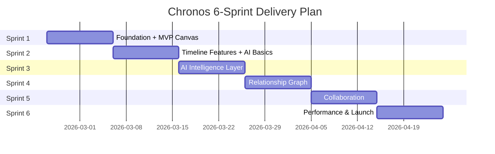

# Chronos: Sprint Plan
**Agile Delivery Roadmap**

**Version:** 1.0  
**Date:** February 10, 2026  
**Sprint Duration:** 2 weeks (10 working days)  
**Total Sprints:** 6  
**Team Capacity:** 40 story points per sprint (9-person team)

---

## Sprint Strategy

### Key Principle: Usable System After Sprint 1

Sprint 1 delivers a **minimum viable vertical slice**—users can:
- ✅ Create an account and log in
- ✅ Create their first project
- ✅ Add characters and events
- ✅ Create a basic timeline
- ✅ Visualize events on timeline canvas
- ✅ **Use basic AI to generate ideas**

This ensures immediate value and early user feedback.

---

## Sprint Overview

---

## Sprint 1: Foundation & Minimum Viable Product
**Dates:** Feb 24 - Mar 7, 2026 (10 working days)  
**Goal:** Deliver a working system where users can create, visualize, and get AI assistance  
**Demo:** User creates project, adds 3 characters, 5 events, sees timeline, generates AI ideas

### User Stories (40 points)

| ID | Story | Points | Owner | Status |
|----|-------|--------|-------|--------|
| E1-US1 | User registration and authentication | 5 | Backend Lead | Not Started |
| E1-US2 | Project creation and management | 3 | Backend Lead | Not Started |
| E1-US3 | Character entity CRUD | 8 | Full Stack | Not Started |
| E1-US4 | Timeline entity CRUD | 5 | Full Stack | Not Started |
| E1-US5 | Event entity CRUD | 8 | Full Stack | Not Started |
| E2-US1 | Basic timeline canvas | 13 | Frontend Lead | Not Started |

**Sprint Backlog Details:**

#### Week 1 Focus: Infrastructure + Backend
- **Days 1-2:** Environment setup, Supabase project, database schema
- **Days 3-4:** Auth implementation (E1-US1), project CRUD (E1-US2)
- **Days 5:** Character CRUD backend (E1-US3)

#### Week 2 Focus: Frontend + Integration
- **Days 6-7:** Character/Timeline/Event UI (E1-US3, E1-US4, E1-US5)
- **Days 8-9:** Timeline canvas implementation (E2-US1)
- **Day 10:** Integration testing, bug fixes, sprint demo prep

### Sprint 1 Deliverables

**✅ End-User Features:**
1. Working authentication (sign up, log in, log out)
2. Create/edit/delete projects
3. Create/edit/delete characters (with name, bio, motivations)
4. Create/edit/delete timelines
5. Create/edit/delete events (assigned to timeline)
6. **Basic timeline canvas showing events chronologically**
7. Zoom/pan timeline
8. Click event to see details

**✅ Technical Deliverables:**
- Supabase PostgreSQL database with entities table
- Row-level security (RLS) policies
- REST API endpoints for all entities
- React frontend with routing
- IndexedDB offline caching (basic)
- CI/CD pipeline (Vercel deployment)

**✅ Acceptance Criteria:**
- User can complete full flow: sign up → create project → add 3 characters → add 5 events → see timeline
- Timeline loads in <3s (50 events)
- Zero critical bugs

---

## Sprint 2: Enhanced Timeline + AI Foundation
**Dates:** Mar 10 - Mar 21, 2026  
**Goal:** Multi-timeline view and basic AI integration  
**Demo:** User manages 3 parallel timelines, asks AI for plot ideas

### User Stories (42 points)

| ID | Story | Points | Owner |
|----|-------|--------|-------|
| E2-US2 | Multi-timeline view | 8 | Frontend Lead |
| E2-US3 | Event drag-and-drop on timeline | 5 | Frontend Lead |
| E3-US1 | Multi-AI provider setup | 8 | Backend Lead |
| E3-US2 | AI model selection UI | 5 | Full Stack |
| E3-US3 | AI idea generation | 13 | AI/ML Lead |
| E1-US* | Additional entity types (Arc, Theme, Location) | 3 | Backend |

### Sprint 2 Deliverables

**✅ Features:**
1. View up to 10 timelines in parallel
2. Drag events to different timeline positions
3. Toggle timeline visibility
4. **AI idea generation based on character/event context**
5. Model selection (OpenAI, Anthropic, Google)
6. Arc, Theme, Location entity types (basic CRUD)

**✅ Technical:**
- AI orchestration service
- Multi-provider abstraction layer
- Circuit breaker for AI failover
- Response caching (Redis)

---

## Sprint 3: AI Intelligence & Consistency
**Dates:** Mar 24 - Apr 4, 2026  
**Goal:** Consistency checking and ripple analysis  
**Demo:** User changes event, sees AI-detected conflicts and suggestions

### User Stories (39 points)

| ID | Story | Points | Owner |
|----|-------|--------|-------|
| E2-US4 | Cross-timeline event indicators | 5 | Frontend Lead |
| E3-US4 | AI consistency checking | 13 | AI/ML Lead |
| E3-US5 | Ripple effect analysis (Antigravity) | 21 | AI/ML + Backend |

### Sprint 3 Deliverables

**✅ Features:**
1. Visual indicators for cross-timeline events
2. **"Check Consistency" button on timelines/arcs**
3. AI flags contradictions (character presence, causality)
4. **Ripple analysis when editing critical events**
5. AI suggests specific changes to resolve conflicts
6. Preview changes before applying

**✅ Technical:**
- Graph traversal queries (recursive CTEs)
- Batch AI requests for performance
- Conflict detection algorithms

---

## Sprint 4: Relationship Graph
**Dates:** Apr 7 - Apr 18, 2026  
**Goal:** Dynamic relationships and graph visualization  
**Demo:** User creates "Alice betrays Bob" relationship, explores 2-hop connections

### User Stories (39 points)

| ID | Story | Points | Owner |
|----|-------|--------|-------|
| E4-US1 | Create custom relationships | 8 | Full Stack |
| E4-US2 | Relationship visualization | 5 | Frontend Lead |
| E4-US3 | Graph traversal queries | 13 | Backend Lead |
| E4-US4 | Visual relationship graph | 13 | Frontend Lead |

### Sprint 4 Deliverables

**✅ Features:**
1. Drag-and-drop relationship creation
2. User-defined relationship types
3. Relationship sidebar on entity view
4. **"Explore Connections" with depth selector**
5. Force-directed graph visualization
6. Filter graph by relationship type

**✅ Technical:**
- Relationships table with adjacency list
- PostgreSQL recursive CTE queries
- D3.js graph rendering

---

## Sprint 5: Real-time Collaboration
**Dates:** Apr 21 - May 2, 2026  
**Goal:** Multi-user editing with presence and conflict resolution  
**Demo:** Two users edit same project, see real-time updates, resolve conflict

### User Stories (37 points)

| ID | Story | Points | Owner |
|----|-------|--------|-------|
| E5-US1 | Real-time updates | 13 | Backend Lead |
| E5-US2 | Presence indicators | 8 | Full Stack |
| E5-US3 | Conflict resolution UI | 13 | Full Stack |
| E6-US2 | Full-text search | 8 | Backend |

### Sprint 5 Deliverables

**✅ Features:**
1. Real-time entity updates (<500ms latency)
2. Avatar icons show active users
3. Highlight entities being edited
4. **Conflict resolution modal (side-by-side diff)**
5. Global search (entities, relationships)

**✅ Technical:**
- Supabase Realtime WebSocket subscriptions
- CRDT-like merge logic
- PostgreSQL FTS with GIN index

---

## Sprint 6: Performance, Offline, & Launch Prep
**Dates:** May 5 - May 16, 2026  
**Goal:** Production-ready system with offline support and analytics  
**Demo:** Work offline, reconnect, auto-sync; show analytics dashboard

### User Stories (38 points)

| ID | Story | Points | Owner |
|----|-------|--------|-------|
| E6-US1 | Offline mode with sync queue | 13 | Frontend Lead |
| E6-US3 | Performance optimization | 8 | Full Stack |
| E6-US4 | Analytics dashboard | 5 | Frontend |
| * | Bug fixes from beta testing | 8 | All |
| * | Documentation and onboarding | 5 | Product + Design |

### Sprint 6 Deliverables

**✅ Features:**
1. **Full offline mode with sync queue**
2. Offline indicator in UI
3. Auto-sync on reconnection
4. Analytics dashboard (entity counts, timeline coverage)
5. Performance meets all targets
6. In-app onboarding tutorial

**✅ Technical:**
- IndexedDB sync queue
- Performance monitoring (Sentry)
- Load testing (10K entities)
- P95 API latency <150ms verified

**✅ Launch Readiness:**
- Zero critical bugs
- <5 high-priority bugs
- All E2E tests passing
- Documentation complete
- Marketing site live
- Beta user feedback incorporated

---

## Sprint Ceremonies

### Daily Standup (15 minutes)
- **When:** 9:30 AM daily
- **Format:** What I did, what I'm doing, blockers
- **Tool:** Slack huddle or Zoom

### Sprint Planning (4 hours)
- **Day 1 of sprint**
- Review backlog, select stories, commit to sprint goal
- Break stories into tasks

### Sprint Review / Demo (2 hours)
- **Last day of sprint**
- Demo to stakeholders
- Gather feedback

### Sprint Retrospective (1.5 hours)
- **Last day of sprint, after review**
- What went well, what to improve, action items

### Backlog Refinement (2 hours)
- **Mid-sprint (Day 5)**
- Refine upcoming sprint stories, estimate new stories

---

## Risk Management

### Sprint-Specific Risks

| Sprint | Risk | Mitigation |
|--------|------|------------|
| 1 | Timeline canvas performance | Use virtualization, limit initial render |
| 2 | AI provider outages | Implement circuit breaker early |
| 3 | Ripple analysis too slow | Limit graph depth, cache results |
| 4 | Graph visualization complexity | Start with simple layout, iterate |
| 5 | Real-time sync conflicts | Implement CRDT-inspired merge |
| 6 | Offline sync edge cases | Extensive testing, conflict queue |

---

## Success Metrics by Sprint

| Sprint | Key Metric | Target |
|--------|-----------|--------|
| **1** | User can create timeline with events | 100% success rate |
| **2** | AI idea generation response time | <5s |
| **3** | Consistency check accuracy | >80% (will improve to 85% post-MVP) |
| **4** | Graph query latency (3-hop) | <200ms |
| **5** | Real-time update latency | <500ms |
| **6** | P95 API latency | <150ms |

---

## Team Assignments

### Sprint 1 Assignments

| Team Member | Primary Stories | Support Stories |
|------------|----------------|----------------|
| **Lead Architect** | E1-US1, Database schema | Code reviews |
| **Backend Engineer 1** | E1-US2, E1-US3 API | E1-US5 API |
| **Backend Engineer 2** | E1-US4, E1-US5 API | DevOps setup |
| **Frontend Engineer 1** | E2-US1 Timeline canvas | E1-US3 UI |
| **Frontend Engineer 2** | E1-US3 UI, E1-US4 UI | E1-US5 UI |
| **Full Stack Engineer** | E1-US5 integration | Testing |
| **UI Designer** | Timeline canvas design | Component library |
| **DevOps Engineer** | CI/CD pipeline, Vercel | Monitoring setup |
| **AI/ML Lead** | Research AI providers | Prompt templates |

---

## Sprint 1 Detailed Task Breakdown

### E1-US1: Authentication (5 points)

**Backend Tasks:**
- [ ] Set up Supabase project
- [ ] Configure email auth
- [ ] Create users table with RLS
- [ ] Implement JWT refresh logic
- [ ] Write API tests

**Frontend Tasks:**
- [ ] Create sign-up form component
- [ ] Create login form component
- [ ] Implement auth state management (Zustand)
- [ ] Add protected routes
- [ ] Handle token refresh

**Definition of Done:**
- User can sign up, receive verification email, log in
- JWT stored in secure HttpOnly cookie
- Invalid credentials show error
- All E2E tests pass

---

### E2-US1: Timeline Canvas (13 points)

**Frontend Tasks:**
- [ ] Research D3.js vs React Flow
- [ ] Set up canvas component
- [ ] Implement horizontal timeline axis
- [ ] Render event markers from API data
- [ ] Add zoom functionality (mouse wheel)
- [ ] Add pan functionality (drag canvas)
- [ ] Implement event click handler
- [ ] Add loading state
- [ ] Performance test with 500 events
- [ ] Write unit tests

**Backend Tasks:**
- [ ] Create GET /timeline/{id}/events endpoint
- [ ] Optimize query with indexing
- [ ] Add pagination support

**Definition of Done:**
- Timeline displays events chronologically
- Zoom/pan smooth (60fps)
- Loads in <3s for 50 events
- Clicking event shows sidebar

---

## Post-Sprint Activities

### Sprint 1 Beta Release
- **Target:** 5-10 internal beta testers
- **Duration:** 3 days parallel to Sprint 2
- **Feedback:** Usability issues, bugs, feature requests

### Sprint 3 External Beta
- **Target:** 50 external users (writers from fiction communities)
- **Goal:** Validate AI accuracy and consistency checking UX

### Sprint 6 Launch
- **Public release on Product Hunt, Hacker News**
- **Marketing campaign begins**
- **Support infrastructure live**

---

## Velocity Tracking

| Sprint | Planned Points | Completed Points | Velocity |
|--------|---------------|------------------|----------|
| 1 | 40 | TBD | TBD |
| 2 | 42 | TBD | TBD |
| 3 | 39 | TBD | TBD |
| 4 | 39 | TBD | TBD |
| 5 | 37 | TBD | TBD |
| 6 | 38 | TBD | TBD |

**Adjustment Strategy:** If velocity <80% planned, reduce subsequent sprint capacity by 20%.

---

## Definition of "Usable System" (Sprint 1)

A user can complete this workflow end-to-end without errors:

1. Sign up for account
2. Verify email and log in
3. Create project "My Sci-Fi Epic"
4. Add character "Alice" with bio
5. Add character "Bob" with bio
6. Add character "Eve" with bio
7. Create timeline "Primary Timeline"
8. Create event "Alice meets Bob" on timeline
9. Create event "Bob betrays Alice" on timeline
10. Create event "Alice seeks revenge" on timeline
11. **View timeline canvas with all 3 events positioned correctly**
12. Zoom in to see event details
13. Click event to open details sidebar
14. Edit event description
15. Log out and log back in (data persists)

**Success Criteria:** 10/10 beta testers complete this flow without assistance.

---

**End of Sprint Plan**

*This plan is a living document. We will adjust based on velocity, feedback, and changing priorities.*
