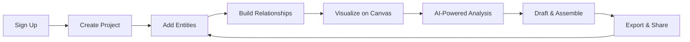
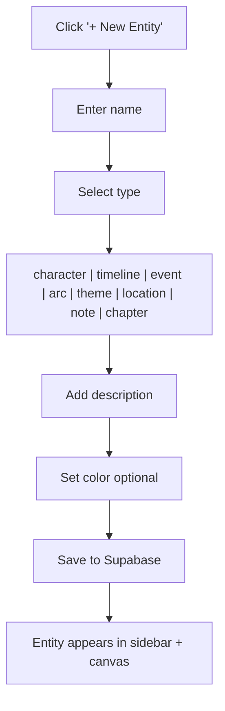
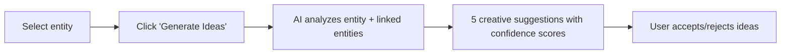
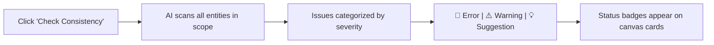
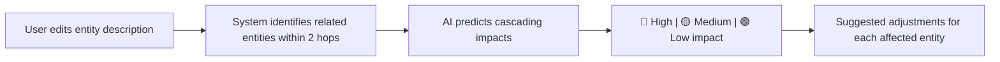
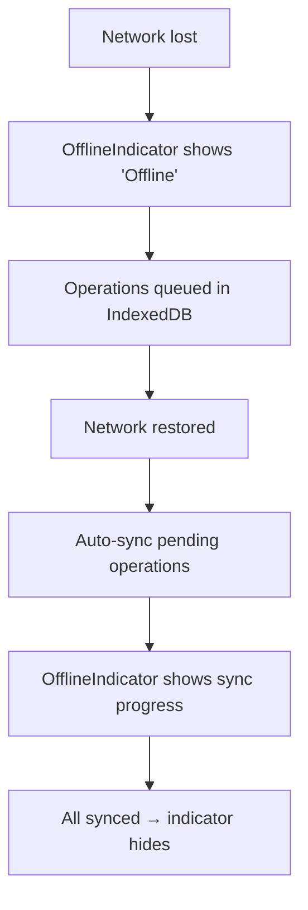
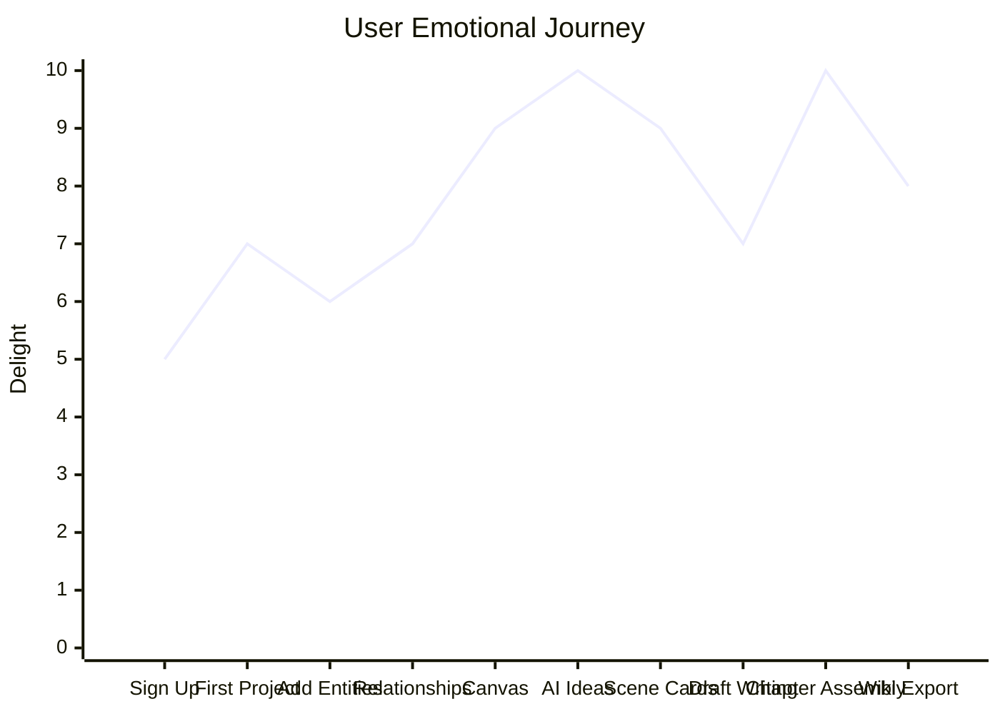

# Chronos — User Journey Map

## Journey Overview

---

## Phase 1: Onboarding

### 1.1 Sign Up
| Step | Action | System Response |
|------|--------|----------------|
| 1 | User clicks "Sign Up" | Show email/password/name form |
| 2 | User submits credentials | Supabase creates account |
| 3 | Session initialized | Redirect to Projects page |

**Error states:** Invalid email, weak password, duplicate account

### 1.2 Sign In (Returning User)
| Step | Action | System Response |
|------|--------|----------------|
| 1 | User enters credentials | Supabase authenticates |
| 2 | Auth state listener fires | Set session + redirect to Projects |

**Timeout:** 8-second fallback if Supabase is slow → show login page

---

## Phase 2: Project Management

### 2.1 Create Project
| Step | Action | System Response |
|------|--------|----------------|
| 1 | Click "+ New Project" | Show name/description form |
| 2 | Submit | Create project in Supabase, navigate to Workspace |

### 2.2 Project Dashboard
- View all projects sorted by last modified
- Quick actions: Open, Edit, Delete
- Project metadata: entity count, last updated

---

## Phase 3: World Building (Core Loop)

### 3.1 Create Entities

**Entity types and their purposes:**
| Type | Icon | Purpose |
|------|------|---------|
| Timeline | ⏱ | Parallel narrative tracks |
| Event | ⚡ | Key plot points / scenes |
| Character | 👤 | People in the story |
| Chapter | 📖 | Structural chapter groupings |
| Arc | 📈 | Story arcs and structures |
| Theme | 💡 | Thematic elements |
| Location | 📍 | Places and settings |
| Note | 📝 | Free-form annotations |

### 3.2 Build Relationships
| Step | Action | System Response |
|------|--------|----------------|
| 1 | Click "Add Relationship" on entity | Show source/target selector |
| 2 | Select target entity | Choose relationship type |
| 3 | Set strength (1–5 slider) | Controls visual line thickness on canvas |
| 4 | Add label (optional) | Save relationship with `metadata.strength` |
| 5 | — | Curved Bézier path appears on canvas |

**Relationship examples:** `involves`, `causes`, `follows`, `contradicts`, `located_at`, `happens_before`, `parent_of`

### 3.3 Event Enrichment
Once events exist, users can enrich them with advanced properties:

| Step | Action | System Response |
|------|--------|----------------|
| 1 | Select an event entity | Detail panel opens |
| 2 | Assign POV character (dropdown) | `pov_character` saved → 👁️ badge on canvas |
| 3 | Set timestamp (date picker) | `timestamp` saved → temporal gap labels appear |
| 4 | Set emotion level (-5 to +5 slider) | `emotion_level` saved → color bar on node |
| 5 | Write draft text (textarea) | `draft_text` saved → 📝 word count badge |

### 3.4 Chapter Organization
| Step | Action | System Response |
|------|--------|----------------|
| 1 | Create a chapter entity | 📖 node appears on canvas |
| 2 | Link events to chapter via relationships | Events become connected scenes |
| 3 | Select chapter entity | Chapter panel shows linked events + word estimates |
| 4 | Click "🔮 Assemble" | AI generates chapter blueprint (synopsis, beats, hooks) |
| 5 | Blueprint saved automatically | Accessible on re-select |

### 3.5 Timeline Variants
| Step | Action | System Response |
|------|--------|----------------|
| 1 | Switch to "Timeline View" | Canvas shows timeline-based lanes |
| 2 | Focus on a specific timeline | Dim other lanes, highlight focused |
| 3 | Create variant for entity | Override name/description for that timeline |
| 4 | — | Purple ◇ DIFF badge marks divergent variants |

---

## Phase 4: Canvas Interaction

### 4.1 Navigation
| Action | Interaction |
|--------|-------------|
| Pan | Click + drag on background |
| Zoom | Scroll wheel (0.05× – 5×) |
| Fit to content | Click ⟲ button |
| Zoom in/out | Click +/− buttons |

### 4.2 Entity Manipulation
| Action | Interaction |
|--------|-------------|
| Select entity | Click on card |
| Move entity | Drag card (snaps to 20px grid) |
| View details | Click → context panel opens |
| Edit properties | In context panel sidebar |

### 4.3 Canvas Visual Features
| Feature | Description |
|---------|-------------|
| Relationships | Curved gradient lines with labels |
| Line thickness | Scales 1.1–3.5px based on strength (1–5) |
| 👁️ POV badge | Top-right on events with assigned POV character |
| 📝 Word count | Top-left on events/chapters with draft text |
| 😊 Emotion bar | Colored bar at bottom of events (red ↔ green) |
| ⏳ Temporal gaps | "X years later" labels between timestamped events |
| ◇ DIFF badge | Purple diamond on divergent timeline variants |
| Status pills | ✔/⚠/✗ after consistency check |
| Minimap | 🗺 button toggle |
| Type filters | Filter chips in sidebar |
| Type / Timeline view | Toggle buttons |

---

## Phase 5: AI-Powered Tools

### 5.1 Creative Tools

#### Idea Generation

**Touchpoint:** Entity context panel → AI section

#### Scene Card Generator
| Step | Action | System Response |
|------|--------|----------------|
| 1 | Select event entity | Detail panel opens |
| 2 | Click "Generate Scene Card" | AI analyzes event + characters + location + themes |
| 3 | — | Scene outline: POV, goal, conflict, resolution, sensory details |
| 4 | Saved to `scene_card` property | Shown as expandable card |

#### Character Voice Samples
| Step | Action | System Response |
|------|--------|----------------|
| 1 | Select character entity | Detail panel opens |
| 2 | Click "Generate Voice" | AI generates 3 dialogue samples |
| 3 | — | Each sample shows context + dialogue + internal thought |
| 4 | Saved to `voice_samples` property | Refreshable with new samples |

### 5.2 Analytical Tools

#### Consistency Check

**Scope:** Project-wide or focused on a specific timeline

#### Ripple Effect Analysis

#### POV Consistency Validation
| Step | Action | System Response |
|------|--------|----------------|
| 1 | Click "👁️ Analyze POV Balance" in Tools menu | AI scans all events |
| 2 | — | Modal shows POV distribution chart (character → count) |
| 3 | — | Issues flagged: missing POV, imbalance, head-hopping |
| 4 | User addresses flags | Re-run to verify fixes |

#### Temporal Gap Analysis
| Step | Action | System Response |
|------|--------|----------------|
| 1 | Click "🕐 Show Temporal Gaps" in Tools menu | AI analyzes timestamped events |
| 2 | — | Modal shows gaps: from → to event with time labels |
| 3 | — | Warnings for suspicious gaps (e.g., aging inconsistencies) |
| 4 | Gap labels also visible on canvas | ⏳ labels between event nodes |

### 5.3 Structural Tools

#### Narrative Sequence Builder
| Step | Action | System Response |
|------|--------|----------------|
| 1 | Click "Build Narrative Sequence" | AI scans temporal relationships |
| 2 | — | Ordered reading path: Chapter 1 → 2 → 3... |
| 3 | — | Each step includes transition suggestions |

#### Missing Scene Detector
| Step | Action | System Response |
|------|--------|----------------|
| 1 | Click "Find Gaps" | AI identifies narrative holes |
| 2 | — | Suggested scenes shown: character A in Location X → unexplained jump to Location Y |
| 3 | Ghost nodes (dotted) appear on canvas | User clicks to create or dismiss |

#### Chapter Assembler
| Step | Action | System Response |
|------|--------|----------------|
| 1 | Select a chapter entity | Chapter panel shows linked events |
| 2 | Review: scene count, word estimate, drafted words | Progress bar visualizes completion |
| 3 | Click "🔮 Assemble" | AI generates comprehensive blueprint |
| 4 | Blueprint displayed | Synopsis, structure beats, hooks, tensions, character arcs |
| 5 | Saved to entity | Available on re-open |

---

## Phase 6: Draft Integration

### 6.1 Writing Drafts
| Step | Action | System Response |
|------|--------|----------------|
| 1 | Select event entity | Detail panel opens |
| 2 | Expand "📝 Draft Text" section | Textarea appears with word count display |
| 3 | Write or paste scene text | Word count updates live |
| 4 | Click outside / blur | Auto-saves to `properties.draft_text` |
| 5 | — | 📝 badge on canvas shows word count |

### 6.2 Progress Tracking
- Event nodes show individual word counts
- Chapter entities show aggregated progress: `drafted / estimated` words
- Search finds text across all event drafts

---

## Phase 7: Export & Share

### 7.1 Worldbuilding Wiki Export
| Step | Action | System Response |
|------|--------|----------------|
| 1 | Click "Export Wiki" in Tools | System generates structured markdown |
| 2 | — | Sections: Characters, Locations, Events, Themes, etc. |
| 3 | — | Each entry includes description + connected entities |
| 4 | Copy to clipboard or download as `.md` | Shareable reference doc |

---

## Phase 8: Settings & Configuration

### 8.1 AI Provider Setup
| Step | Action |
|------|--------|
| 1 | Navigate to Settings page |
| 2 | Select provider (OpenAI / Anthropic / Google) |
| 3 | Enter API key |
| 4 | Choose default model |
| 5 | Keys saved to localStorage (never sent to backend) |

### 8.2 Available Models
| Provider | Models |
|----------|--------|
| OpenAI | GPT-4o, GPT-4o Mini, GPT-4 Turbo |
| Anthropic | Claude 3.5 Sonnet, Claude 3 Haiku |
| Google | Gemini 2.0 Flash, Gemini 1.5 Pro |

---

## Phase 9: Collaboration (Real-Time)

### 9.1 Presence
- User avatars appear in workspace header when multiple users are in the same project
- Active editing entity is broadcast to all collaborators

### 9.2 Real-Time Sync
- Supabase Realtime subscriptions on entities, relationships, and variants tables
- External changes auto-invalidate cached queries
- Toast notifications: "Entity X was updated by another user"

### 9.3 Conflict Resolution
| Scenario | System Action |
|----------|---------------|
| No conflict | Save normally |
| Conflicting edit | Show `ConflictModal` with side-by-side diff |
| User chooses | "Keep Mine" / "Accept Theirs" / Manual merge |

---

## Phase 10: Offline & Search

### 10.1 Offline Mode

### 10.2 Global Search (⌘K)
| Step | Action | System Response |
|------|--------|----------------|
| 1 | Press ⌘K | Search overlay opens |
| 2 | Type query | Full-text search across all entities + draft text |
| 3 | Results grouped by type | Click result → navigate to entity |

---

## Emotional Journey

**Peak moments:** First canvas visualization (seeing the world come alive), AI scene card generation (events become writeable scenes), chapter assembly (story structure crystallizes)

**Friction points:** Initial AI setup (need API key), understanding timeline variants (learn by doing), first chapter assembly (need to link events first)
